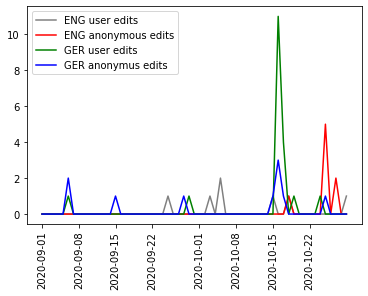

# Assignment 1
> **Date:** 08.11.202 - 19:32 PM *(Due: 10.11.202 - 03:00 PM)*  
> **Name:** `arro` Arne Rolf  
> **Session:** [01 Exercise](01_exercise)   
---

## A1 - Warm up

* Setting up the environment was a bit more time-consuming than I expected. It took me about two and a half hours just to get Python and Poetry installed and set up. I'm currently using macOS and had previously installed Python 3.7.4 version. I removed everything associated with this installed version and installed the latest Python 3.9 via Homebrew. This went fine and also installing Poetry via Homebrew was no problem at all.
The problem started arising when I was trying to install the dependencies with `poetry install`. The package `scipy` and `numpy` always threw a huge log of errors. Basically the Error was: 
```Could not build wheels for scipy which use PEP 517 and cannot be installed directly```
Of course I Google the upcoming issues but nearly all solution mentioned failed. After a while I stumbled upon a kinda recent [issue](https://github.com/pandas-dev/pandas/issues/37057) related to my problem. The problem boiled down to an incompatibility with Python 3.9 and the two dependency versions set fixed in the Poetry lock file.
Both had received a minor version bump in the last few days or weeks, that provided the comparability with Python 3.9. So the solution was to update the Poetry dependencies with the `poetry update` command. I might create an issue in the Repo and with it a PR containing the updated dependency lock file.

### Wikipedia Edits

* Solving the last hand-on task was kinda easy. The example code above provided all the necessary information needed to put a solution together. I simply added the two additional end points for the German version of an article about [the electoral college](https://de.wikipedia.org/wiki/Electoral_College) and changed the existing URLs to point to the correct English version of the article. Here I was a bit lazy and kept the merged dataset separated by language, so that I ended up with two variables called `de_merged_data` and `en_merged_data`. At last, I gave every plot a different color, renamed and added the labels. The result can be seen here: 
* 

#### Challenges
* The most challenging task was definitely the setup of the environment but the tasks in the notebook were quite easy.
* I learned that I still have to get used to the Python syntax again. The last time I programmed in Python was at least a year ago. But it reminded me immediately, how little code is needed (at least in Python) to get a lot done. 
Working with pandas and plotting with matplotlib was a new experience for me and I noticed, that there is a lot to be learned in these tools.
One additional thing that I learned was that Wikipedia has a REST API to access different statistics. I didn't know that before. 

## R1 - Reflection
> Podcast: Human-centered Design in Data Science (with Peter Bull)


### 🗨️&nbsp; "How does the podcast inform your understanding of human centered data science?"  
I didn't know beforehand that there are generators for data ethics checklists you could use for your own project to make sure for example, that your participants have given informed consent. 
Also interesting was the fact that even though a project might sound great for a machine learning process in the abstract it can still introduce a huge bias in the decision-making.
In addition, I really valued the concept that human centered factor begins with the data collection and that data scientists should observe how their data gets collected in the real world.

### ❓&nbsp; Questions 
1. In the beginning they spoke about best practices in data science, so I'm now wondering if there is a good collection out there.
2. They talked about that empathy is a core skill for data scientist and that one should approach to solve tasks with the attitude of problem first rather than method first. There they didn't mention if this was something that is thought in general in university or if this is a skill that just some individuals thought themselves.

A bit off-topic but I liked how they mentioned that they use a similar approach to the folder structure for data science projects as in software engineering.
