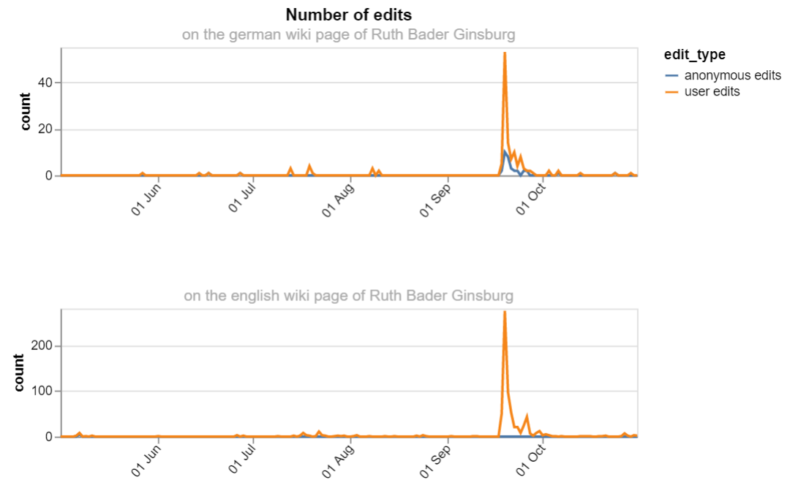

# Title of your post
> **Date:** 02.11.202 - 15:30 PM *(Due: 10.11.202 - 03:00 PM)*  
> **Name:** `alsc` Alexa S.  
> **Session:** [01 Exercise](01_exercise)   
----

## A1 - Warm up

As I already took part in some courses where we used Python and Jupyter Notebook luckily my
environment was already ready for starting with the assignment. 

### Wikipedia Edits

The last hands-on assignment was pretty easy for me to implement as most of the required code was 
given inthe previews task. I just had to wrap it into a method and run it for a wiki page in two 
different languages. 

For the visualization part I first plotted the data with the matplotlib library what worked well but 
looked not so nice. Therefore tried it out with the altair which is a declarative visualization library 
for Python, based on Vega-Lite I learned in the Data Visualization course. 

With altair it was pretty easy to implement a nice looking visualization with some iteractive 
elements like a tooltip showing the date and the amount of edits when hovering over one of the cuves
and the possiblity of zooming in.

#### Challenges
* Chllenging for me was to understand the task with the following description "✏️ _Which columns interest you? Replace RR and Entity with other column labels_" and I am not sure if my solution is correct. 
I understood it is asked to replace the column names "RR" which had been renamed to "leisure" at that time and the column "Entity" to some other name. 

* More interesting then suprising for me was to try out the BeautifulSoup library. I used it for the first
time. It seems to be powerfull for extracting informations from web pages. 

## R1 - Reflection
> Podcast: Human-centered Design in Data Science (with Peter Bull)

### 🗨️&nbsp; "How does the podcast inform your understanding of human centered data science?"  
At least 2-3 full sentences.

### ❓&nbsp; Questions 
1. ...
1. ...

Some text about why ...
