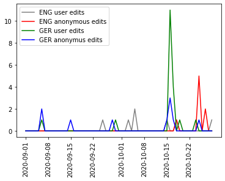

# Assignment 1
> **Date:** 08.11.202 - 19:32 PM *(Due: 10.11.202 - 03:00 PM)*  
> **Name:** `arro` Arne Rolf  
> **Session:** [01 Exercise](01_exercise)   
---

## A1 - Warm up

* Setting up the environment was a bit more time-consuming than I expected. It took me about two and a half hours just to get Python and Poetry installed and set up. I'm currently using macOS and had previously installed Python 3.7.4 version. I removed everything associated with this installed version and installed the latest Python 3.9 via Homebrew. This went fine and also installing Poetry via Homebrew was no problem at all.
The problem started arising when I was trying to install the dependencies with `poetry install`. The package `scipy` and `numpy` always threw a huge log of errors. Basically the Error was: 
```Could not build wheels for scipy which use PEP 517 and cannot be installed directly```
Of course I Google the upcoming issues but nearly all solution mentioned failed. After a while I stumbled upon a kinda recent [issue](https://github.com/pandas-dev/pandas/issues/37057) related to my problem. The problem boiled down to an incompatibility with Python 3.9 and the two dependency versions set fixed in the Poetry lock file.
Both had received a minor version bump in the last few days or weeks, that provided the comparability with Python 3.9. So the solution was to update the Poetry dependencies with the `poetry update` command. I might create an issue in the Repo and with it a PR containing the updated dependency lock file.

### Wikipedia Edits

* Solving the last hand-on task was kinda easy. The example code above provided all the necessary information needed to put a solution together. I simply added the two additional end points for the German version of an article about [the electoral college](https://de.wikipedia.org/wiki/Electoral_College) and changed the existing URLs to point to the correct English version of the article. Here I was a bit lazy and kept the merged dataset separated by language, so that I ended up with two variables called `de_merged_data` and `en_merged_data`. At last, I gave every plot a different color, renamed and added the labels. The result can be seen here: 
* 

#### Challenges
* The most challenging task was definitely the setup of the environment but the tasks in the notebook were quite easy.
* I learned that I still have to get used to the Python syntax again. The last time I programmed in Python was at least a year ago. But it reminded me immediately, how little code is needed (at least in Python) to get a lot done. 
Working with pandas and plotting with matplotlib was a new experience for me and I noticed, that there is a lot to be learned in these tools.
One additional thing that I learned was that Wikipedia has a REST API to access different statistics. I didn't know that before. 

## R1 - Reflection - [ TBA ]
> Podcast: Human-centered Design in Data Science (with Peter Bull)


### 🗨️&nbsp; "How does the podcast inform your understanding of human centered data science?"  
At least 2-3 full sentences.

### ❓&nbsp; Questions 
1. ...
1. ...

Some text about why ...