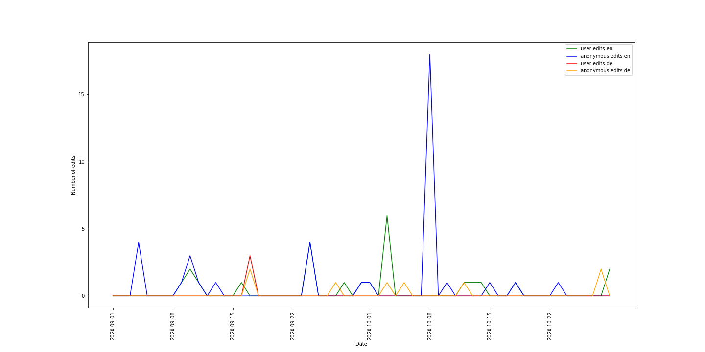

# Title of your post
> **Date:** 08.11.202 - 19:30 PM *(Due: 10.11.202 - 03:00 PM)*  
> **Name:** `chki` Christopher K.  
> **Session:** [01 Exercise](01_exercise)   
----

## A1 - Warm up

* Experience with seeting up the environment.
Setting up the environment went smoothly. I only had a little problem installing one dependency using poetry install (I'm using Windows). I had to install Visual Studio Build Tools to fix that. 

### Wikipedia Edits

* Briefly describe how you solved the last hand-on task.
Task: Try to visualize user edits and anonymous edits of two Wikipedia language versions of an article of your choice. We probably use more Wikipedia and wikidata during the next exercises, so it's worth getting familiar.

First of all, I queried some data using the API. I tried a few articles until I found one which was edited by users and anonymous users for bothe the German and the English version. Using the example with Amy Coney Barrett as a template, I loaded the data into DataFrames, renamed the columns (adding de/eng to differentiate the language) and merged them into one big DataFrame. Then, I converted the timestamps and created the plot also adding labels for the axes and adjusting the legend.

* Add an image of your plot here and describe what you can see. 🖼️ 

The plot shows the number of edits per day for the English and German wikipedia article on computer science. The different graphs show how many edits were made by registered users and anonymous users for each of the two articles over time (see legend).
One can see that more anonymous edits were made for both the German and the English article. Also, there was a peak of 18 anonymous edits on the English article on 8th of October.

#### Challenges
* Describe what tasks were challenging to you.
It was actually quite difficult to find a good dataset on GovData. I tried one dataset about beginning students which had a couple of lines of meta information at the beginning which read_csv could not handle. I found datasets which were simply not available (for example 'Badegewässer Stammdaten') and datasets which had weird formats.

Also, finding good colors and a good size to make all parts of the pie chart nicely visible was pretty hard.
Apart from that, the exercises were pretty simple. 

* What was surprising, what did you learn? 😮 
I read data from csv/json/API already, but it was my first time to parse XML with python.
Also, I never consumed rss news feeds. So these were the two things where I definitely learned the most.

## R1 - Reflection
> Podcast: Human-centered Design in Data Science (with Peter Bull)

### 🗨️&nbsp; "How does the podcast inform your understanding of human centered data science?"  
At least 2-3 full sentences.

### ❓&nbsp; Questions 
1. ...
1. ...

Some text about why ...
