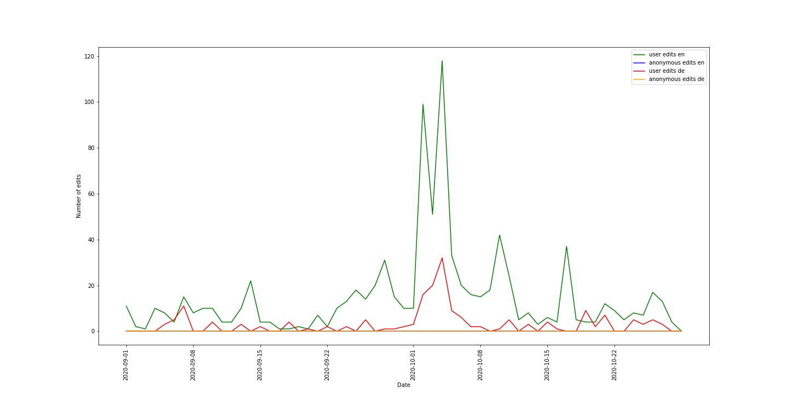

# Assignment 1
> **Date:** 10.11.202 - 12:30 PM *(Due: 10.11.202 - 03:00 PM)*  
> **Name:** `Francosinus` Franziska Rau  
> **Session:** [01 Exercise](01_exercise)   
----

## A1 - Warm up

Setting up the environment went well. Had to install poetry via pip, afterwards all worked well and I could open and edit the notebook. It has been while since I worked with github, so I had to learn about all the commands again. Lucky me, everything worked out well and I didn't delete something. 

### Wikipedia Edits

In the last hands on section I selected a wiki article about Trump. I thought there were a lot of edits on this article, because it has always been a recent topic. So I chose the german and english article and performed the steps which were done before with only the english article. I merged the dataframes and renamed the columns. Afterwards I plotted the results of anonymous and user edits. 

#### Challenges
The most challenging task was to work with Github. I created a local branch just to be sure that everything works out well. Since I study Data Science I already programmed a lot in Python, so I hope the next assignments won't be that challenging to me. 

## R1 - Reflection
> Podcast: Human-centered Design in Data Science (with Peter Bull)

### 🗨️&nbsp; "How does the podcast inform your understanding of human centered data science?"  
Peter Bull encourages to think from a human standpoint in data science. 
Data science and software are influenced by decisions because there’s context involved, if there is no context, data is just data. With the help of human centered design that kind of context can be provided. By releasing developments without considering the real outcomes, there is a risk of ignoring or even creating ethical problems.

### ❓&nbsp; Questions 
1. How can machines take over a process both effectively and ethically? (referring to bias in data)
2. "We can't even get this tool installed" was mentioned while talking about team collaboration. I definitely feel that. How can we improve the user friendliness for team projects? 

