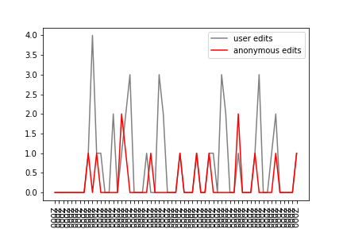
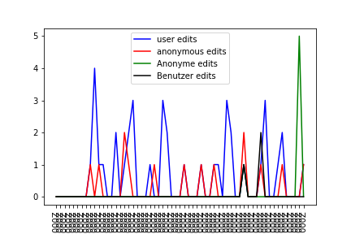

# Assignment 1
> **Date:** 02.11.202 - 15:30 PM *(Due: 10.11.202 - 03:00 PM)*  
> **Name:** `goto` Gorgin  
> **Session:** [01 Exercise](01_exercise)   
----

## A1 - Warm up

I am using Ubuntu (in WSL2) so I had the usual annoyances and handicraft to do that occur when using Linux, such as dependency problems. This would be less bothering if only there were proper error messages. You get what you pay for.
Other than that, it took some time to walk through everything because Jupyter is new to me. I find it actually handy.

### Wikipedia Edits

I went the same way as in the examples before, only this time for the programming language C. To find it, i just opened the Wikipedia Homepage, searched for C and copied the important part of the URL . I then pasted that URL-part into the example line to create a link for both user and anonymous (the endpoints)
Then, back on the Wikipedia-Page, I changed for both topics the language and continued as above, so finally I had four endpoint-variables, epAnonDe, epUserEn, ...
Now, it was mostly done the same way as in the examples, i just needed to merge more (did not search for a way to merge all at once). Also, I used matplotlib's function savefig() to save the figure/plot to a file which is shown below:

#### Challenges
Challenging was to get the ball rolling. After that, with the examples provided, it was actually not very difficult. But it's the first assignment and supposed to be a warm-up. The last task was more challenging, e.g. shown was to read the json file but it was rather a byte-stream/string than a json-object. It was fun to do this:

I refreshed some Python, learned how to get started with the libraries and the notation with the nested edged brackets which reminded me of R.

## R1 - Reflection
> Podcast: Human-centered Design in Data Science (with Peter Bull)

### 🗨️&nbsp; "How does the podcast inform your understanding of human centered data science?"  
When Amazon was mentioned, I looked up what else there is and found an article about a software that wants to calculate the probability that an inmate will become criminal again after being set free. Judges can use this to decide if they can be released on parole. However, it's prophecies not only turned out to be wrong, they also had a bias against black people. In hindsight, that's kinda obvious, yet I just have not thought about it before.
Being purely blunt now, it was then that I realised the importance of human-centered views in general. Before, I thought of it as rather nice-to-have, like keeping UX in mind to make systems easier to use, more intuitive, etc. but I forgot about it's impact on society.

### ❓&nbsp; Questions 
1. Maybe rather philosophical: If you need data that is a snapshot of decisions made by humans (such as the data about job-applicants), is it possible to free the data from some bias? To which degree and how? 

2. If it's so obvious that you can't just tell your ml-algorithm to use whatever data, why isn't this on the agenda of any and every data science course instead of being an extra module?

