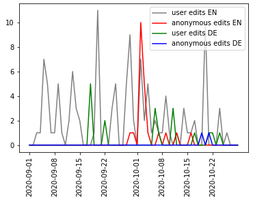

# Assignment 1
> **Date:** 10.11.2020 - 12:30 PM *(Due: 10.11.202 - 03:00 PM)*  
> **Name:** `jowe` Jonas W.  
> **Session:** [01 Exercise](01_exercise)   
----

## A1 - Warm up

* Experiance with seeting up the environment.
  
Setting up the environment was very straight forward to me and came with no big problems. My git CLI knowledge was a bit rusty so I used vscode to write the markdown and handle git.

### Wikipedia Edits

* Briefly describe how you solved the last hand-on task.
I followed the example in the Notebook and expanded it to use data of 2 languages instead of 1. After choosing some random articles I switched to a recent topic so the graphs wouldn't be (almost) flat.
* Add an image of your plot here and describe what you can see. 🖼️

The data is pretty much as expected - the english site is edited more frequently than the german one and edits are more commonly done by users with accounts than anonymous visitors. There's also a huge spike in anonymous edits in the first week of October, which suprised me. 

#### Challenges
* Describe what tasks were challenging to you.

There were no real problems in the first Assignment. I had to try multiple datasets from GovData as some wouldn't load properly for different reasons, other than that there was no real struggle.
* What was surprising, what did you learn? 😮 
  
As my previous experience regarding datasets, webscraping, etc. is pretty limited, I was quite surprised about the ease to access very in-depth data of various topics, which is very cool.

## R1 - Reflection
> Podcast: Human-centered Design in Data Science (with Peter Bull)

### 🗨️&nbsp; "How does the podcast inform your understanding of human centered data science?"  
The podcast informed me about the importance of approaching a data science project by looking at the problem to solve first, rather than a specific method or technology to use. Especially the example of the primate researchers struggling to even install the tools to use their algorithm displayed the problem that computer and data scientist may fall into the trap of expecting the users to have the same technical skills as them, very well, which is very important but was less prevalent in my understanding of "human-centeredness" in data science.

### ❓&nbsp; Questions 
1. How starry-eyed is the statement that 'going where the data originates from' is possible in nearly every case? I think it is a great idea to do that but not possible in a lot of projects for various reasons. Maybe observing the data collection may even introduce new problems where the researcher believes some date is false/incomplete/etc. because of statements from involved persons which might be very subjective.
2. When the topic of 'models you can trust' came up I was wondering how transparent e. g. deep learning algorithms actually are, since I do not have any experience in this field. So my question would be if it's even possible to develop models and algorithms you can 'trust' if they might behave like a blackbox, or if the missing trust originates from choices of the developer/researcher?