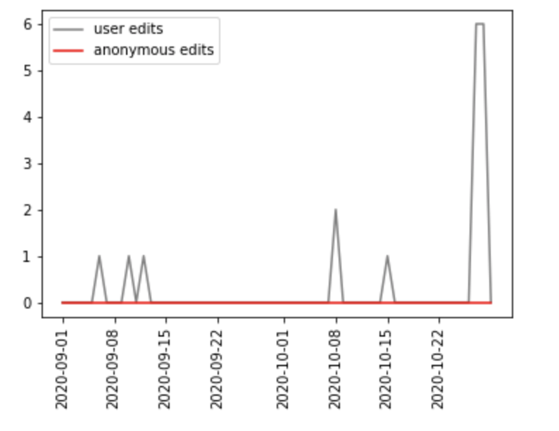

# Title of your post
> **Date:** 02.11.202 - 15:30 PM *(Due: 10.11.202 - 03:00 PM)*  
> **Name:** `alsc` Alexa S.  
> **Session:** [01 Exercise](01_exercise)   
----

## A1 - Warm up

Setting up the programming environment was fairly easy. The main obstacle was figuring out how to use Jupyter Notebooks, but after a few minutes of reading through the examples and watching a few tutorials I started to understand the main funcionalities and benefits of writing your code there, in comparison to writing it in a normal editor. Using pandas and matplotlib was also a great experience for me, since I had not really made a lot of exeriences with both. Especially pandas was very fun to use, since it makes working with data so easy, especially after mainly using C for data related assignments in the past two years.

### Wikipedia Edits

As already mentioned in the section above, I was really blown away by the functionality of pandas, which I was again shown during this part of the assignment. Getting the edits data from a specific wikipedia article was very easy and pretty similar to the examples above. The same goes for merging the 2 editing data frames and then displaying them. I really appreciated all the detailed examples, since they made it a lot easier for less experienced course participants to understand the basic functionalities of both packages and saved me a lot time that I would have otherwise had to spend looking up every single function !

I started with getting the endpoints for both the anonymous and user edits. I then formatted both into the JSON format and filtered them, so they would only include the values for "items" and "results". After that I merged both dataframes into one and plotted them into a graph with is shown below. In the end I also added a legend to the graph.

The graph shows the page edits on the english version of the Wikipedia site "Empire State Building". It displays both the anonymous and user edits of the page, though there are no anonymous edits during the entire timespand from September 1st to October 22nd. On the other hand there are three user edits during September and then again three in the first halt of October. At the end of October there is actually a large increase of user edits to 7 edits within a very short timeperiod.

#### Challenges
I had the biggest challanges with adding a colormap to the pie chart, mainly because I read the task wrong the first time and tryed adding a colormap to the bar chart, which  in the end was a lot harder than just adding the colors to the plot methodcall. 
As mentioned above it also took me a few minutes to really get a feeling for Jupyter Notebooks in generell. Besides that a got through the whole programming part of the assignment fairly easily.

Besides learning the basic functionalities of the pandas and matplotlib, and obviously understanding Jupyter Notebooks and the benefits of being able to split up the code and writing normal text inbetween, I was mostly surprised to see how similar the concepts with working with data are in pandas, as they are in other programming languages. Especially all the convenient methods of loading data and easily formatting and changing it showed me, that my programming experience from other languages will be very helpful in completing this course !

## R1 - Reflection
> Podcast: Human-centered Design in Data Science (with Peter Bull)

### 🗨️&nbsp; "How does the podcast inform your understanding of human centered data science?"  

For me one of the main takeaways from the podcast was how machine learning can lead to misunderstanding and falsly analysing data. I found the story about amazons hiring algorithms and their bias towards men particularly interesting, since one would assume that a computer would have a completely objective view on an application. It really showed how to an alorithm that is self learning can use certain parameters, that a human would not take into consideration when solving the problem. This gave me a good understanding of why the human aspect in data science is very important and often times overlooked, since people that write the algorithms often times only look at the problem from a strictly logical point of view. I also found it very interesting that such algorithms are therefor always being checkt by humans for biases or other unwanted sideeffects and that for example in the case of amazon they actually had to stop developement of the algorithm because they coundn't stop the bias from happening. 

### ❓&nbsp; Questions 

1. Will it be possible to write an algorithm that is completly unbias ?

Falling back on the paragraph above, I'm wondering wether it will be possible in the future to have algorithms do work such as selecting an applicant without bias. Obviously a human interviewer would also have certain biases in an interview, which might be very different to a computer (e.g. a human would probably look much more at the appearance of the interviewee). But besides the huge gain in efficiency, a computer also has the opportunity to handle such a problem with complete objectivity, something a human could never do. 

2. Should such an algorithm handle problems completly objectively ?

The question above raised another question to me, wether an algorithm should actually be purely objective. A certain paramenter might logically indicate, that a certain applicant is better or worse suited for the position, but that parameter might be very unethical to use (e.g. the data might indicate that a certain relegion is better suited for the job, but this may only be due to a lack of available data and also it would be highly discriminating to hire a person over another person based on their religion). So the algorithm would have to be modified to take those kind of parameters out of consideration, but this leads back to question 1 wether such an algorithm could be implemented, since there is an unknown amount of those kinds of parameters. Also the choice of the acceptibility of a parameter is again subjective, since it is made by humans...
