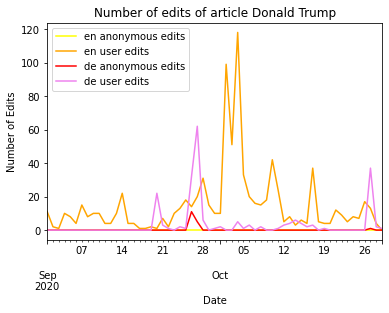

# Title of your post
> **Date:** 08.11.202 - 15:30 PM *(Due: 10.11.202 - 03:00 PM)*  
> **Name:** `mane` Marisa N.  
> **Session:** [01 Exercise](01_exercise)   
----

## A1 - Warm up

* Experiance with seeting up the environment.

### Wikipedia Edits

* Briefly describe how you solved the last hand-on task.

I used the example shown before in the notebook and expanded it so that not only one Wikipedia language was included into the data set but two. Therefor I searched for a Wikipedia page that might has had intersting edit flactuation depending on the languge (I picked Donald Trump from the german and english Wikipedia). For plotting I also looked into former described code, that could be easily reused.

* Add an image of your plot here and describe what you can see. 🖼️ 

You can see that there are overall much more edits done by users that were logged in than by anonymous users in both language versions. If you compare the user edits of both versions, it is remarkable that the german Wikipedia has an edit peak at around  26th and 27th Septmeber whereas in the english Wikipeida there is much more flactuation but with the highest spike around 3rd and 4th October. Overall there much more edits applied to the article in the english Wikipedia than in the german.

#### Challenges
* Describe what tasks were challenging to you.

Most challenging was actually finding an RSS feed to get data from and then to interpreet it. I was searching for a specific RSS endpot but cound't find it :(

* What was surprising, what did you learn? 😮 

Goes into the same direction as the answer before: It positivly suprised me how easy it is to get data from a well structured, somhow described endpoint in contrast to parsing html pages.  

## R1 - Reflection
> Podcast: Human-centered Design in Data Science (with Peter Bull)

### 🗨️&nbsp; "How does the podcast inform your understanding of human centered data science?"  

The podcast shoes what problems can arise when the human side in a data science process is not well considered and which methods can help to prevent these issues. In this context, the speaker talks about the importance of a human centered design process, in which the user and the desired outcome of the system should always be the first priority. He also introduce mulitiple principles, that human cetered data scientist should use and follow, such as an iterative design porcess, consisting of three phases (i.e. inspiration, ideation, implemetation), combining quantitative with qulitativ data and four core activities such as going into the field or building consensus on metrices for success. 

### ❓&nbsp; Questions 
1. How widely is the deom checklist used at the moment? (Because the checklicst sound really interesting but do for example more profit oriented companies use such tools?)
1. Do they (DrivenData) only work with data scientists or also with people from other discipliens? And if so, how are these different backgrouds merged within the process? (Because it sound a bit like the team is mostly composed of computer scientists.)
