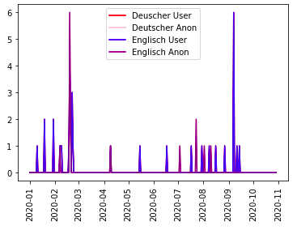

# Assignment 1
> **Date:** 09.11.2020 - 09:30 PM *(Due: 10.11.2020 - 03:00 PM)*  
> **Name:** `maop` Marc O.  
> **Session:** [01 Exercise](01_exercise)   
----

## A1 - Warm up

I was very happy about the tutorial, because it helped me a lot with the setup. The only problem that unfortunately took me too much time than it should have, was that I unknowingly had Python version 2.7 and therefore I was unable to proceed with the installation of jupyter notebook. Upgrading to Python 3.9 solved this issue for me.

### Wikipedia Edits

* It took me a while to find Wikipedia Articles in German and English. After finding what I was looking for I basically recycled the given Code, retrieved the necessary data via the APIs and merged the data sets. After formatting the datasets, and relabeling the lines, I got to choose the colors for the plots.

It might not be the prettiest diagram, but at least its made with love. You can see the visualisation of the merged datasets by German/English anonymous and user edits. I was surprised about how overlapping the different colored lines are, but I figured out that if you look at the user/anon edits for the German and English article seperately, you can see that they're almost identical. This leads me to believe, that most of the changes were made simultaneously. I indeed could've scaled the image better because it does look a bit squeezed...

#### Challenges
* Unless you really stick to the given code examples it is sooo easy to get lost in Pandas wide variety of features, which cost me me more time that I would like to admit ¯\_(ツ)_/¯.
* Honestly I was very surprised about the "magic" that took place in the WarmUp Exercise at first. Once you start to go through every codeline step by step you slowly start to understand what is actually going on there . I did start to slowly learn to love Pandas eventhough I felt pretty lost at first. 

## R1 - Reflection
> Podcast: Human-centered Design in Data Science (with Peter Bull)

### 🗨️&nbsp; "How does the podcast inform your understanding of human centered data science?"  
Data Science and machine learning can help companys and individuals to be more effective by data collection and acquire access to different perspectives of interpretation of these Data Sets. It indeed has a bigger impact on ethical aspects (e.g. discrimination against women in Amazon’s application process) than I thought. Also, the role of empathy in data Science was an enrichment of our knowledge, because during university courses you tend to work with the scheme of “methods first” which were introduced in the lectures prior to the given exercises. While I was used to working with this scheme, I never actually thought of the danger of what actually happens when you start working “methods first” and end up with a solution that might not be perfectly suitable to the given problem.

### ❓&nbsp; Questions 
The question I came up with is based on the ideo of untrustworthy data. The question was triggered by the following statement: “You have to distinguish between trustworthy data and data you cannot trust”. I do have a hard time understanding how one cannot trust the empirically gathered data when the data is based on your own observations by going out and surveying the consumers behavior. Although I'm aware that there might be certain measure inaccuracies, I believe that getting a wide-ranged overview of consumers behavior is a perfectly acceptable data foundation.

