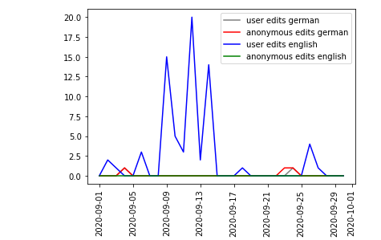

# Title of your post
> **Date:** 02.11.202 - 15:30 PM *(Due: 10.11.202 - 03:00 PM)*  
> **Name:** `alsc` Alexa S.  
> **Session:** [01 Exercise](01_exercise)   
----

## A1 - Warm up

Settings up the programming environment was very easy. Poetry installation went without problems. I am using Pycharm,
so i used the integrated git features to pull the project. From within pycharm i used the peotry commands to then start the notebook.

### Wikipedia Edits

I did look for an antricle and decided for "Predident of the United States" in english and german. Just like in the example before,
i queried the api for edit data for the german and english version of the article and for anon/user edits.

i then merged the german anon and user data first, renamed the columns. Then i merged the result with the english anon edits,
again renaming the column. At Last, i merged this with the english user edits.

For finishing up, i plotted all 4 columns with different colours in one plot. Result can be seen here:

#### Challenges
I am relatively new to data science, have used pandas briefly before and also matplotlib. As such, i had to refresh/learn
a lot of stuff about these, which took a little bit of time. I also had some problems with the csv task, as many opf the
govdata .csv datasets produced an error when importing it.

I was surprised by how powerful pandas and the other tools are for analyzing data and how easy it is to get good results
with them. I also was surprised about the kinds of data laying around on GovData :D

## R1 - Reflection
> Podcast: Human-centered Design in Data Science (with Peter Bull)

### 🗨️&nbsp; "How does the podcast inform your understanding of human centered data science?"  
At least 2-3 full sentences.

### ❓&nbsp; Questions 
1. ...
1. ...

Some text about why ...
