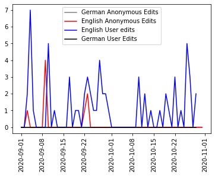

# Assignment 1
> **Date:** 09.11.2020 - 20:27 PM *(Due: 10.11.202 - 03:00 PM)*  
> **Name:** `xiyu` Xin Yu.  
> **Session:** [01 Exercise](01_exercise)   
----

## A1 - Warm up

* Experience with setting up the environment.

    * I have python on my computer as well as jupyter notebook in anaconda, but I know nothing about poetry and git bash. For avoiding dependency problems, I just followed the steps described in the "First things first" page. Actually, I am unsure if I did it right.
    * I am so new to Git/GitHub and really unfamiliar with words like "repo root" or those GitHub words. I was wondering if I did the setup appropriately. I cloned the repository locally but I have no idea where it is. 
    
### Wikipedia Edits

* Briefly describe how you solved the last hand-on task.

    * Wikimedia task
        * I opened wikipedia website and found a random topic on the page.
        * I seperate the records for user edits and anonymous edits.
        * I generally followed the steps from the given example and created two separate graphs for both kinds of edits.
    * COVID 19 task
        * It is similar to given example in Jupyter.
        * The tricky sep here is how to extract the information of datetime. The all detailed information seem to be stored as list of dictionaries in the dataframe as a single entry. So I first chose three countries out of the dataframe and deal with the date information seperately.

* Add an image of your plot here and describe what you can see. 🖼️ 

    
   
     Unfortunately, there are no edits from German users can be seen in the plot. Maybe the US election is not considered as an interesting topic in German-speaking countries/regions. We can see huge flucatuations along with the time in amout of edits from Englisch speakers. There are completely no edits from 1st to 8th October, and the anonymous edits don't appear in september. The peak value of edits from both user accounts as well as anonymous accounts lays around 9th or 10th September. It could be related to some social/political event in the US. More information could be revealed from the picture if we compare it to real newsfeeds.

#### Challenges
* Describe what tasks were challenging to you.
    * For me, I think the setup stuff as well as the usage of GitHub as well as Markdown is more challenging for me due to lack of experience.
    * <del>Regarding the task itself, I had problems with the BeutifulSoap task, since the error message I got is "lxml not found, please install it". However, I used pip install to install the lxml in python but still get the same error.</del> Solved, but still doesn't work. Have problems with the code itself.
      
* What was surprising, what did you learn? 😮
   * Surprisingly bad at Jupyter & Python. :pensive: As if it was my first exposure to it.
   * Never experienced in web scraping but wished to learn. Happy to have first impression on that.
   * Happy to learn Markdown. It was my first time using this language so I need to continuously look at my cheatsheet and wasted lot of time. Hopefully it comes as the course proceeds.

## R1 - Reflection
> Podcast: Human-centered Design in Data Science (with Peter Bull)

### 🗨️&nbsp; "How does the podcast inform your understanding of human centered data science?"  

The tranformation from method-oriented to problem-oriented. The needs of humans and problem context are more considered as the data being analysed. Data scientists do not only focus on cooling results with complicated algorithms. The outcomes should be suitable to specific context/problem setting. Furthermore, the usage of data science projects is more important. The human factors and human-related perspectives should be calculated throughout different phases of the data project design process.

### ❓&nbsp; Questions 
1. I am interested in the bias problem mentioned in the podcast. Bias can be generated however by algorithm itself as well as in the data collection process. Besides obervation of data collection, is there any method to detect bias in data or in algorithm and how to prevent the problem?

