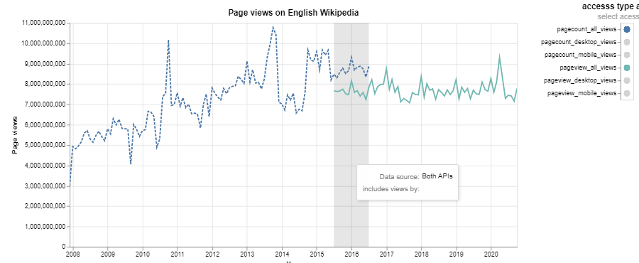

# Title of your post
> **Date:** 07.11.2020 - 15:37 PM *(Due: 17.11.2020 - 03:00 PM)*  
> **Name:** `albe` Ali B.  
> **Session:** [02 Exercise](https://github.com/FUB-HCC/hcds-winter-2020/wiki/02_exercise)   
----

## R2 - Reflection
> Book: The Practice of Reproducible Research (Chapter 2 and 3)

### Definitions
_Reproducibility and replicability_

- **Reproducibilit:** Means that another researcher team can reproduce the same outcome of the research (documentation, data, tables, figures), the same qualitative and quantitative results by following the same steps, applying the same methods and **using the same data**

- **Replicability:** Means the same as Reproducibility with the difference that the different team uses **different data** than the original researcher team. 

_How does this relate to the definitions given in the lecture?_

By comparing the definitions I could not find any differences in the definitions of these two terms. 

### 🗨️&nbsp; "How does the reading inform your understanding of human centered data science?"  
_Describe in at least 2-3 full sentences._

My takeway is that with the methods introduced the research should be comprehensible for and repatable for others. I think 
in human centered data science this special role as it makes the research understandable and easier to validate. 

### ❓&nbsp; Questions
_List at least 1 question (full sentence) that this reading raised in your mind, and say why._

As I understood in case of reproducibility the repeating research team is using a dataset which the original research team also used and is providing in their publication. This could be for example time measured durring an experiment with test persons.  
Is it only called reproducibility if the repeating research team is using the data set of the original team (eg. the table with the time measured)? 
If I understood it correct creating the (same) dataset with applying the same methods and repleating the time measurement with diffrent 
users but the same demographic distribution is not reproducing the research but replicating? Because there are extraneous variables making the dataset of the repeating team different such as different psychological state of the test persons, different daytime, region etc. 

***

## A2 - Reproducibility Workflow
_Briefly describe your experience using the reproducibility workflow._

I fist started this assingment with getting an understanding for the API and the parameters. 
Then I started with use these parameters to acuire the data from the API and to build the filenames 
with the specified convention. Then I started to build a directory structure and continued with 
following pre proccing steps which I know from the usual pre proccessing steps. 

### Final Wikipedia Page View Plot
_Add an image of your plot here and describe what you can see._ 🖼️ 

In the area where we have overlapping data from both APIs it is notable that for the desktop site (mobile site is the same) we have more views with the Pagecounts API. This coud be because the Pagecounts API includes also views from Bots. 

Also the trend is notable that over the time the views for the desktop side is decreasing while the views from mobile site is increasing. 

Unfortunatally I was not able change the format of the y-Axis label to display the values in billions. I spend a lot of time seaching a way ow this can be done in altair but could't find a solution now. I assume this is possible by passing a format to the y-Axis like '.1f' for 
float numbers with 1 digit after the comma which works well. 

### Challenges

For me a big challange was the big patience to spend the extra amount of efford for the data pre processing step. 
From other data sience projects I know that some amount of effort is required for the pre processing step but in this 
small project I had the feeling that I spend a bit more time on building an understandable structure for my project.

_What was surprising, what did you learn?_ 😮 

I knew that pre-processing is time comsuming but I was suprised that I still underestimated this efford >.<'

