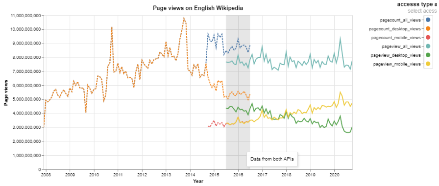

# Goal of the project

The goal of this project is to acquire data about wikipedia page views from english wikipedia and to visualize this data to allow exploaration and comparison of diffrent acess sites over time. 

# Where is the data from?

The data is acquired from following APIs: 

- The **Legacy Pagecounts API** (for documentation see: https://wikitech.wikimedia.org/wiki/Analytics/AQS/Legacy_Pagecounts)

- The **Pageviews API** (for documentation see: https://wikitech.wikimedia.org/wiki/Analytics/AQS/Pageviews

- For terms and condition of REST API see: https://www.mediawiki.org/wiki/Wikimedia_REST_API#Terms_and_conditions

- The license of source data is available under the *Creative Commons Attribution-ShareAlike License*

# How is the project structured? 

All processing is performed in the Jupyter Notebook with the name A2_ReproducibilityWorkflow. 
This project is structured as follows: 

**Data acuasition:** In this part the raw data is downloaded using the APIs and are stored in the directory *\raw_data\json* in json format. The filename is following the convention apiname_accesstype_firstmonth-lastmonth.json.

**Prerequesites:** In this part the raw data is checked for anomalies (eg. nan values, end date before start date) and some preproccing is perforemed as a preparation for further analysis. The resulting data after pre proccssing is 
safed in the directory  *pre_processed_data/csv*. 

The pre proccced data *en_wiki_views_pre_proccessed.csv* is a table withthe following 5 columns: 

year: The Year in which the view trafic observations were made. Extracted from the timestamp.
month: The month in which the view trafic observations were made. Extracted from the timestamp.
pagecount_all_views: Sum of all view trafic observations (mobile and desctop) made with the Pagecounts API.
pagecount_desktop_views: Data from Pagecounts API. The count of views made with the access type desktop. (Please note that this includes views from spiders/crawlers) 
pagecount_mobile_views: Data from Pagecounts API. The count of views made with the access type mobile. (Please note that this includes views from spiders/crawlers)
pageview_all_views: Sum of all view trafic observations (mobile and desctop) made with the Pageviews API.
pageview_desktop_views: Data from Pageviews API. The count of views made with the access type desktop. (Please note that this includes only views from human users)
pageview_mobile_views:  Data from Pageviews API. The count of views made with the access type mobile. (Please note that this includes only views from human users)

**Analysis:** In this part some further processing is performed and the data is visualized in and interative chart. At the end of this part the results are stroed in the directory *clean_data/*. 
The data used for the visualization is stored under *clean_data/csv* and the visualization is stored under *clean_data/visualization/html*.

The final data *en_wiki_views_clean.csv* conists of a table with 5 columns: 

year: The Year in which the view trafic observations were made. Extracted from the timestamp.
month: The month in which the view trafic observations were made. Extracted from the timestamp.
view_type: The access type and api where the view trafic observation *count* made from.
count: The amount of views observed for the view_type.
timestamp: Timestamp in monthly granularity for the observed page views.

#The final visualization:

The final visualization is composed by 3 charts which are linked one interactive visualization. 

1. A linechart showing all page views for all access types. The X is the time axis . The y axis encodes the amount of views and the color encodes the API where the data is a from and the accces type. 
2. A circle chart with only a y axis and the color encodes the api and the access type. This chart is linked with the linechart and serves as an interactive legend. By clicking on a circle appropriate line is selected in the 
linechart.
3. A rectangle chart is used to superimpose the linechart and mark the area for the data for all data belonging to one of the API or both. 

