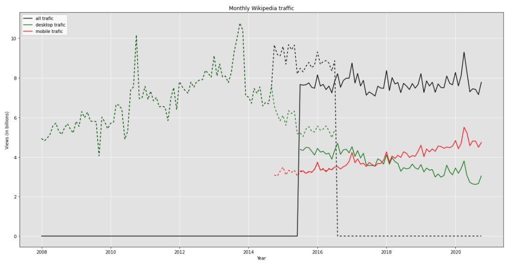

# Assignment 2
> **Date:** 15.11.2020 - 10:39 PM *(Due: 17.11.2020 - 03:00 PM)*  
> **Name:** `arro` Arne Rolf 
> **Session:** [02 Exercise](https://github.com/FUB-HCC/hcds-winter-2020/wiki/02_exercise)   
----
## [Link to my repository](https://github.com/Arne117/A2-hcds-hcc-FU-WS_20)

## R2 - Reflection
> Book: The Practice of Reproducible Research (Chapter 2 and 3)

### Definitions
**Reproducibility**: "[...] the ability of a researcher to duplicate the results of a prior study using the same materials as were used by the original investigator. That is, a second researcher might use the same raw data to build the same analysis files and implement the same statistical analysis in an attempt to yield the same results." 1

**Replicability**: "[...] refers to the ability of a researcher to duplicate the results of a prior study if the same procedures are followed but new data are collected." 1

---
> [1] Goodman, S. N., Fanelli, D., & Ioannidis, J. P. A. (2016). What does research reproducibility mean? Science Translational Medicine, 8(341), 341ps12–341ps12. http://doi.org/10.1126/scitranslmed.aaf5027
---

_How does this relate to the definitions given in the lecture?_

In the lecture we learned the ACM's (Association for Computing Machinery) differentiation version 1.1 which states:
- **Repeatability** (Same team, same experimental setup)
  - [...] For computational experiments, this means that a researcher can reliably repeat her own computation.
- **Reproducibility** (Different team, same experimental setup)
  - The measurement can be obtained with stated precision by a different team using the same measurement procedure, the same measuring system, under the same operating conditions, in the same or a different location on multiple trials. For computational experiments, this means that an independent group can obtain the same result using the author’s own artifacts.
- **Replicability** (Different team, different experimental setup)
  - The measurement can be obtained with stated precision by a different team, a different measuring system, in a different location on multiple trials. For computational experiments, this means that an independent group can obtain the same result using artifacts which they develop completely independently.

In the book they state an older version if the ACM differentiation which mainly differs on the definition of:
- **Reproducibility** (Different team, different experimental setup)
  - The measurement can be obtained with stated precision by a different team, a different measuring system, in a different location on multiple trials. For computational experiments, this means that an independent group can obtain the same result using artifacts which they develop completely independently.
- **Replicability** (Different team, same experimental setup)
  - The measurement can be obtained with stated precision by a different team using the same measurement procedure, the same measuring system, under the same operating conditions, in the same or a different location on multiple trials. For computational experiments, this means that an independent group can obtain the same result using the author’s own artifacts.

The ACM updated their terminology on August 24, 2020 to version 1.1 (which is more inline with the definitions stated in the book) with the following statement:
> As a result of discussions with the National Information Standards Organization (NISO), it was recommended that ACM harmonize its terminology and definitions with those used in the broader scientific research community, and ACM agreed with NISO’s recommendation to swap the terms “reproducibility” and “replication” with the existing definitions used by ACM as part of its artifact review and badging initiative. ACM took action to update all prior badging to ensure consistency.

> Source: https://www.acm.org/publications/policies/artifact-review-and-badging-current

### 🗨️&nbsp; "How does the reading inform your understanding of human centered data science?"  
I acknowledged how important programmatic automation is when you transform your data and visualize it. In previous modules of my bachelor we often manually transformed some data but we never really wrote the necessary steps down to reproduce the results again.

I also never heard that there is a spectral format such as HDF5 to store multi-dimensional array data.
### ❓&nbsp; Questions
_List at least 1 question (full sentence) that this reading raised in your mind, and say why._

I was wondering if there is a service or software that a researcher could use to get informed about the availability of his datasets. Through his career he/she might use different options to store research data. If the structure of the service changes, the service shuts down or the data just isn't accessible anymore, it would be good to know for the researcher get notified about this so he/she can perform actions.

***

## A2 - Reproducibility Workflow
Retrieving the data from the REST API was quite easy. 
Working with the Pandas library turned out to save a lot of time compared to creating the required `.csv` file with just pure python. 
Describing then each step in a Jupiter notebook feels a bit like teaching someone how to code who has little knowledge in programming.

### Final Wikipedia Page View Plot

### Challenges
Most challenging for me was to turn the raw json data into one single correctly formatted pandas data frame. I still have to get used to work with pandas and all its possibilities.

_What was surprising, what did you learn?_ 😮
I found pandas syntax to work with Strings in a Series pretty neat.
