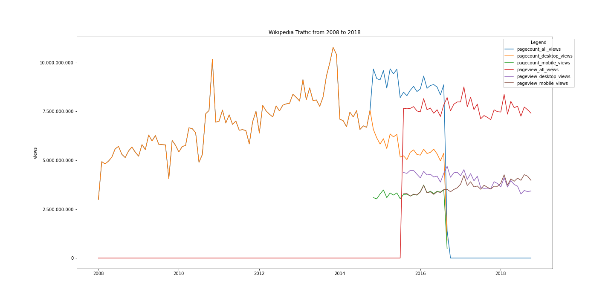

# Title of your post
> **Date:** 07.11.2020 - 15:37 PM *(Due: 17.11.2020 - 03:00 PM)*  
> **Name:** `luka` Lukas Kaibel 
> **Session:** [02 Exercise](https://github.com/FUB-HCC/hcds-winter-2020/wiki/02_exercise)   
----

## R2 - Reflection
> Book: The Practice of Reproducible Research (Chapter 2 and 3)

### Definitions

**Reproducibility**
A different team gets the same result, while using the same data (materials).

**Replicability**
A different team gets the same result, while using different data (materials).

This way of defining reproducibility and replicability is similar to the way they where both defined in the lecture. On the contrary the ACM's definitions of the two are reversed, but the book doesn't use their definition.

### 🗨️&nbsp; "How does the reading inform your understanding of human centered data science?"  

My main take away from the article was the unexpected difficulty of making research projects computationally reproducable. It oulined the many different pieces that have to work together to make the research reproducable, such as the well documented programmming code, the continuity of different versions, the accessibility of the used data and many more. The chapter therefor gives an interesting insight in the importance of these "rules" to make it easier to validate the project outcomes or find discrepancies between the original project and the repitition.

### ❓&nbsp; Questions

* How often does a research project have to be reproduced in order for it's outcome to be accepted as valid ? 
* Does a single failed reproduction of the project neglect multible successful ones ?

## A2 - Reproducibility Workflow

Although it was a little more work to export the data into seperate files to then later load them back into the programm, it actually proved to be a nice and elegant way to structure the work and keep a clean overview over the project. It becomes especially apparent how this sort of structuring makes it a lot easier for another party to go through the programm and maybe even replicate it. 

### Final Wikipedia Page View Plot

### Challenges

The main challange with this assignment was learning the structure of the data, especially since the two differnt api's where used. Also the merging of the 5 dataframes combined with the restructuring of the metadata was challanging. 
