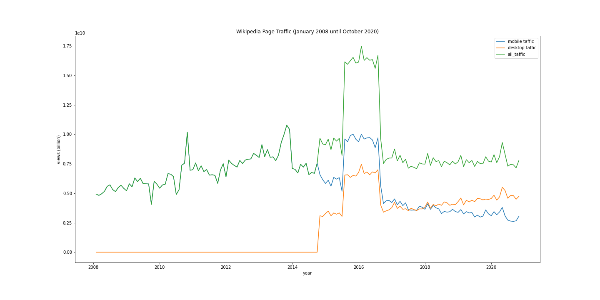

# Title of your post
> **Date:** 07.11.2020 - 15:37 PM *(Due: 17.11.2020 - 03:00 PM)*  
> **Name:** `alsc` Sebastian K.  
> **Session:** [02 Exercise](https://github.com/FUB-HCC/hcds-winter-2020/wiki/02_exercise)   
----

## R2 - Reflection
> Book: The Practice of Reproducible Research (Chapter 2 and 3)

### Definitions
In the lecture we learned, that repoducibility means redoing research with the same data and methods as before, getting the same result. Replicablity on the other hand is replicating the research with completely new data, but still achieving the same result. Different to Repeatability, Reproducibility and Replicability is achieved by another team, where Repeatability is done by the initial researcher.
Those definitions are very similar to the definitons from the text.

### 🗨️&nbsp; "How does the reading inform your understanding of human centered data science?"  
The reading states that documentation is key for achieving reproducability or replicability. This is true for all kinds of science but especially in human centered data science due to ethical problems. Reproducability helps with clean reasearch and strengthens the research itself, especially with new findings.

### ❓&nbsp; Questions
Is there a better way to make reproducability or replicability easier while working with a large team, despite documenting each researchers work on its own?

## A2 - Reproducibility Workflow
The reproducibility workflow was quite interesting. Due to the fact that we had to find our own workflow it was more challanging than last week. Nevertheless it was a nice challange that showed me how to work with the Wikipedia API and Pandas in a specific task.

### Final Wikipedia Page View Plot

This is the final plot of my data analysis. Just as the task said, the Plot contains the page traffic for the english wikipedia between January 2008 and October 2020. One this, that looks kind of odd is the bump between 2015 and 2017. I think the problem there is, that both API had data for the same time period, so adding both data sets doubled the peak in this time period.

### Challenges
Cleaning the data was a little bit challanging, but after searching the web for needed functions I managed to get my workflow running. After all I learned a few tricks in Python and Pandas I didn't knew before.

