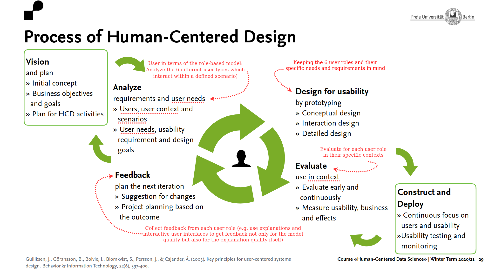
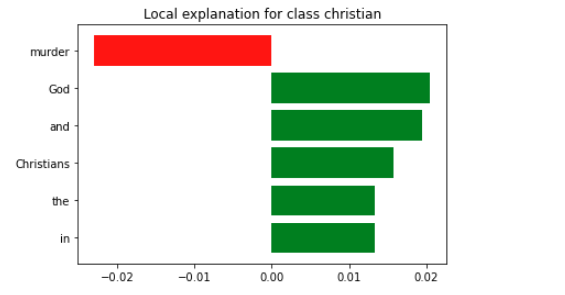
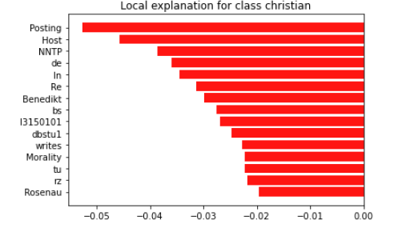
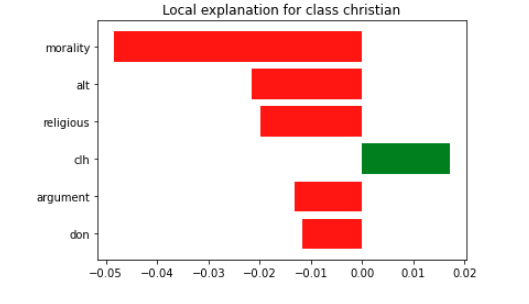

# Title of your post
> **Date:** 05.01.2021 - 18:35 PM *(Due: 11.01.2020 - 03:00 PM)*
> **Name:** `mane` Marisa N.
> **Session:** [07 Exercise - Explanations](https://github.com/FUB-HCC/hcds-winter-2020/wiki/07_exercise)   
----

## A5 - Explanations

### Task 1: Different Explanation Needs

#### ORES Scenario

Scenario: editing Wikipedia

When a Wikipedia user does an edit to Wikipedia, other Wikipedia users or aplications may use a machine learning system (ORES) to determine of what quality this edit is. Based on the given score the user or aplications might change or even revert the edit. This ecosystem contains an Wikipedia user who did an edit and a machine learning system for assessing the edit quality.

1. Creators: 
* Wikimedia Scoring Platform Team
* Aaron Halfaker and Dario Taraborelli
* Probably other not transparently listed volunteers and collaborators

Explanation needs: The creators need explanations about the systems performance to *improve their understanding of the system such that they can better optimize it for their preferred metrics* (e.g. how good the predicted scores align with the reality).

2. Operators:
* The ORES API itself, which provide ORES scores to other Wikipedia users or applications
* Applications (e.g. tools, features, gadgets, bots and services) that directly access the ORES API and provide the scores to other Wikipedia users or use the ORES scores by themself
* Wikimedia users that directly access the ORES API and use the ORES scores by themself

Explanation needs: The operator needs explanations about how the system works. That means how to input data and query the system such that the operator can fullfill the needs of the excutor. The operator also need explantions about how and why a decision was made to be able to pass that infromation to the executor.

3. Executor:
* Applications, which use the ORES scores by themself (e.g. bots, which decide based on an ORES score whether to revert an edit or not)
* Wikimedia users, which are either also operators or get the scores from applications (e.g. so called patrollers, who decide based on an ORES score provided by a gadget whether to revert an edit or not)

Explanation needs: The executor needs explanations about the system’s outputs, that means how and why decisions were made (e.g. why an revision is calssified as damaging). 

4. Decision-subject: 
* Wikimedia users, who did edits

Explanation needs: The decision-subject needs explanations about why an executor made a particular decision (e.g. why a revison was reverted).

5. Data-subjects: 
* Other Wikimedia users, who did edits
* Other Wikimedia users, who classified these edits manually

Explanation needs: The data-subjects may what to have explanations about how their data is being used to make decisions, so they *may want to understand how their data affects a machine learning system’s outputs* (e.g. if other users edits are more or less classified as damaging).

6. Examiners:
* There are no dedicated examiners, but it is possible for other Wikipedia users to report problems (e.g. via Phabricator, JADE, Wiki pages, or directly contact Wikimedia Scoring Platform Team).

Explanation needs: The examiners need both explanations about the system's performance and about how to interact with the system, that means how to input data and query the system to be able to test the system's work (e.g. testing which revisons are classified as damaging, etc.).

#### Reflection

We would use this HCI method in every step of the human centered design process, beginning with the very first step: the analysis. We think that this role-based model can help in each step, because the system that is bulid, is bulid for humans with diffenrent types of needs and requirements and not only for one type of human being. This has to be considered in every step. Furthermore this method can help to better differentiate and understand the different user-roles and how these roles interact with each user.

### Task 2: Explanation method: LIME

[LIME-Notebook](Lime.ipynb)

ID 84:  
\
ID 66:  
\
ID 01:  
\

#### Reflection

i. We choose the documents listed with the ID 01, 66 and 84. From which two of them where christian class and the other one (66) was from the atheism class.

ii. We learned that the model is a binary classifier. It extracts text from emails and is looking to classify an email as either atheism or christan through the use of recurring words represented from the class. Here it is important to note that the model itself chooses the words and weighs them respectivley. Another note should be that emais headers etc. are not removed neither from the model nor from any human in the pre-processing.

iii. The results for all 3 of the ID's was correct and the one classifying the atheist email was remarkably good in aspect to it's certainty. In case for the christian email it classified it correctly but not as certain. Looking further into the explanations one can see that the classifier is giving words from the email headers to the atheism class (NNTP, Re, ...). That could be a major reason why the classifier was more certain for atheism than for christian since these words occur in every or at least most emails. The results of the model are correct but in aspect to how well it is doing we actually have to answer this with the model is not well enough in doing it's job.

iv. Executor and Decision-subject: Since they need to see further explanation on why a decision from the model was made.

v. Pretty useful since they can understand the model without the full knowledge about machine learning. For example for a skin cancer classifier anyone can determine with LIME what aspects of the tumor lead to a positive decision and can exclude a biased decision like skin color etc.

vi. "What factors lead to this decision?"
