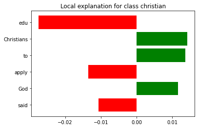
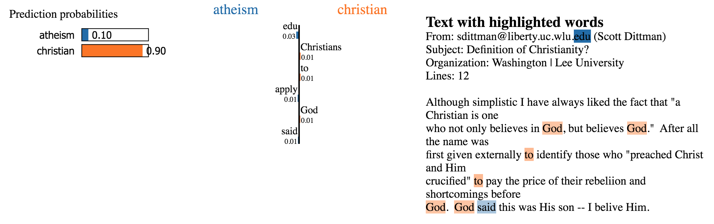
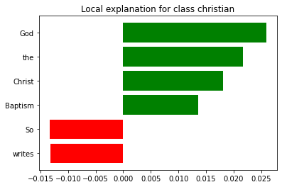
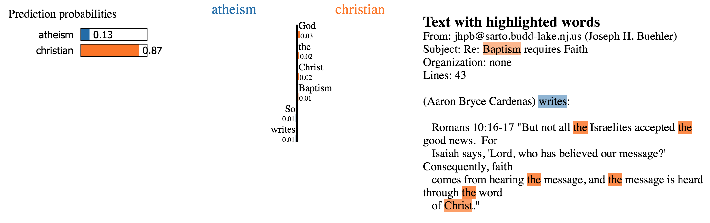
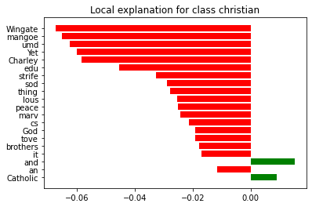
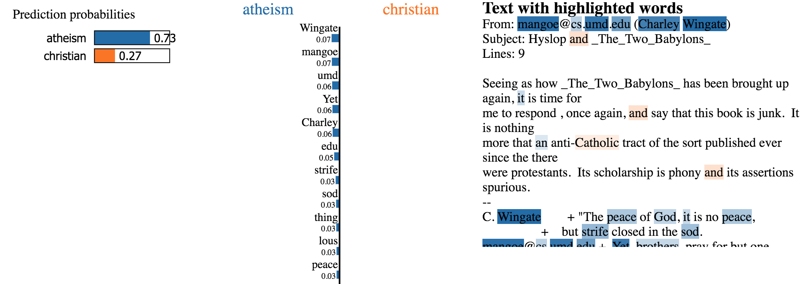

# Assignment 5
> **Date:** 02.01.2020 - 19:22 PM *(Due: 11.01.2020 - 03:00 PM)* 
> **Name:** `arro` Arne Rolf 
> **Group:** Arne Rolf (`arro`) and Malina S. (`masc`) and Marc O. (`maop`) 
> **Session:** [07 Exercise - Explanations](https://github.com/FUB-HCC/hcds-winter-2020/wiki/07_exercise)   
----

## A5 - Explanations

### Task 1: Different Explanation Needs

#### ORES Scenario

**Please describe the roles and the different explanation needs in the context of ORES by writing your own scenario.**
**Tool to detect incomplete and unsufficiently proven articles**

*Description:* Machine learning algorithms are used to detect incomplete and unsufficiently proven articles. These algorithms are used by editors and administrators which are then able to detect deficient articles. This tool finds articles that are not yet complete in terms of content and at the same time check whether the articles are adequately supported with evidence. This is important to maintain the quality of articles on Wikipedia. The data is being retrieved through a specific Wikipedia article and compared to other ones of a similar kind. The algorithm outputs whether all important information of a topic is included and proven. This ecosystem contains a machine learning system for rating, (a team of) editors that have written the article and editors that are ........... HIER FEHLT WAS

* Creators: Who creates the machine learning system? ORES is a web service that provides machine learning as a service for Wikimedia Projects. Therefore the Creators are Wikimedia employees.
* Operators: Who interacts directly with the machine learning system? In this case, operators are developers as well as the contributors of this project.
* Executors: Who makes decisions that are informed by the machine learning system? Executors are editors because their decisions are based on the output of this tool
* Decision-subjects: Who is affected by decision(s) made by the executor(s)? Affected by these decisions are articles and implicitly also editors.
* Data-subjects: Whose data has been used to train the machine learning system? Training and Test data is mostly based on reviewed articles. That means that the machine learning system uses the data (articles) that has been created by contributors/editors
* Examiners: Who is investigating the machine learning system? Examiners can be experts on the articles topic. They are most likely to be able to examine whether an article meets the topic and sufficiently scientifically proven.

**Explanation needs**
* Operators need explanations of how this machine learning systems works and need to take its features into consideration.
* Executors also need explanations of how this system works and what input may lead to a specific output.
* Decision-subjects: Decision-subject agents need explanations on what feature affects a certain result in order to understand what feature lead to this prediction and why an executer decided accordingly.
* Data-subjects: Data-subjects might need explanations on how certain training/test data is being used to train the model.
* Examiners: Examiners also need an explanations on how this output was induced in order to investigate the machine learning system and how to deal with this system.

### Reflection
_your TEXT here_

_your IMAGE here_

### Task 2: Explanation method: LIME

<!-- [LIME notebook](/assignments/A5_Explanation/arro/Lime.ipynb) -->
[LIME notebook](https://github.com/FUB-HCC/hcds-winter-2020/blob/main/assignments/A5_Explanation/arro/Lime.ipynb)

#### 1:

#### 2:

#### 3:

#### Reflection

##### 1. Which documents did you choose? 
We choose the documents with the following ids: `102, 48, 54`.

The first document with the id `102` is predicted with a probability of 90,2% to be christian. The mail is from an educational domain, but contains a christian content.
Here we see again that the model learned aspects such as the domain ending `.edu` to be associated to atheism. Words such as `Christians` and `God` tend to favor for the christian category.

The second document with the id `48` contains a pure christian content, where the model weighted the words `God`, `the`, `Christ` and `Baptism` the most to be associated with christian category. Words such as `So` and `writes` tend to occur more in the atheism category.

The last document with the id `54` is again from an educational domain but this time the body content actually contains words such as `God`, `anti-Catholic`, `protestants` but none of them were in the six features. So we increased the feature number to `20` until we saw the first words associated with the christian category. Here we see again that the most relevant aspects seem to be in some form of meta information and not from the text content itself.

##### 2. What did you learn about the model?
The machine learning classifier learned the wrong aspects by providing it for this instance with unnecessary meta information. The lime explainer helped to find out a flaw, which should be initially detected in the data pre-processing phase. All X training and test data should only contain the relevant body text of the e-mails.

##### 3. How well do you think the classifier works? Why?
The classifier is flawed as described in the previous question. The model can only be used partly to indicate, if an e-mail was written by an christian. Here the model seemed to have learned some correct aspects, but this can't be said for the atheism category where the model relied often on metadata such as an education `.edu` domain.

##### 4. For what role(s) (from task 1) are LIME explanations useful? Why?
TBD

##### 5. How useful is LIME for a non-data-scientist (e.g. non-ml-experts or designer)? Why?
Lime might be able to provide some sort of knowledge with its examples and documentary, but I find it hard to believe that someone without a basic understanding of the ML code can really use lime effectively. You have to know where and how to implement lime into a code sequence which isn't something a designer for example usually does. Non ml experts however might be able to interpret an explained model by lime that someone else programmed.

##### 6. What question types is LIME able to answer? Why?
Lime can explain individual classifier predictions that are made based on numerical, categorical or image data. You can get a better understanding on what parts from the input data X is used and weighted the most to create the prediction result.
