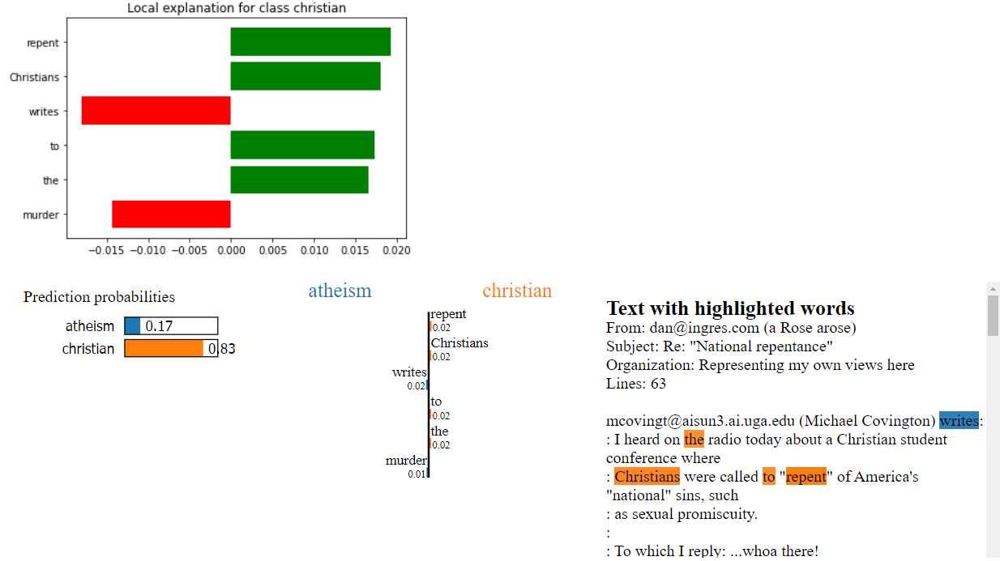
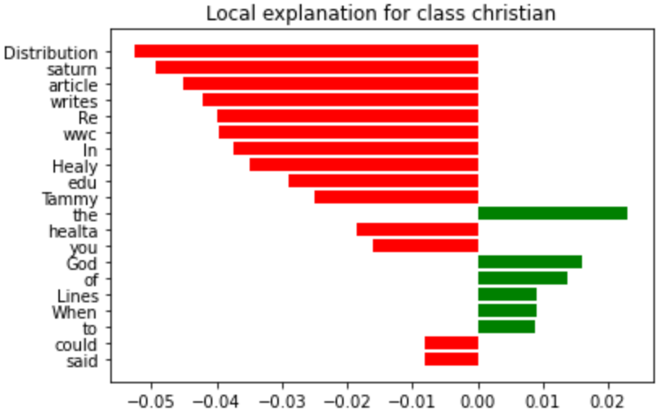
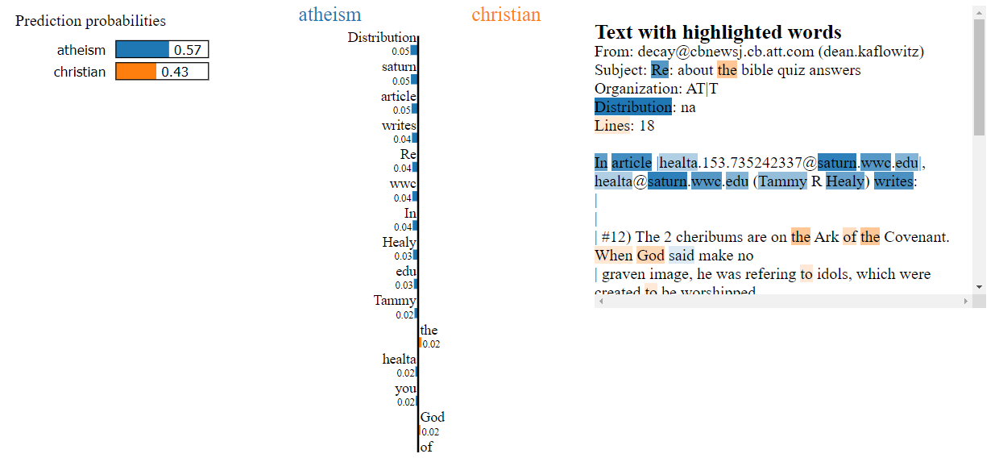
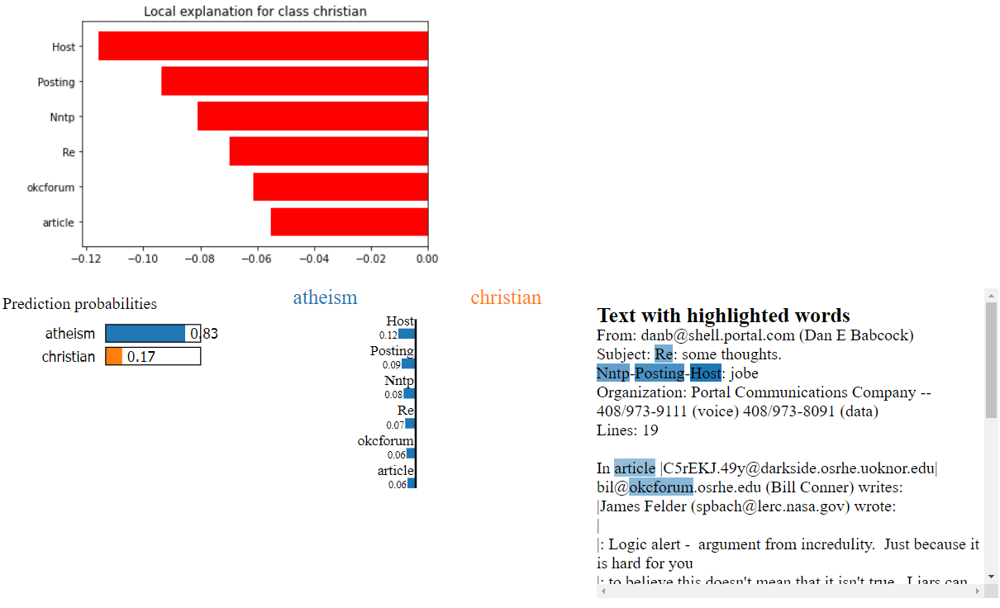

# Explanation
> **Date:** 23.12.2020 - 18:35 PM *(Due: 11.01.2020 - 03:00 PM)*
> **Name:** `chki` Christopher K.
> **Group:** `albe` Ali B. and `chki` Christopher K.
> **Session:** [07 Exercise - Explanations](https://github.com/FUB-HCC/hcds-winter-2020/wiki/07_exercise)   
----

## A5 - Explanations

### Task 1: Different Explanation Needs

#### ORES Scenario
__Please describe the roles and the different explanation needs in the context of ORES by writing your own scenario.__

**Tool to fight vandalism in wikis**

Description: To detect vandalism in wikis, many machine learning algorithms have been developed and deployed.
These algorithms are often used by tools which then again assist editors and maintainers of wikis. For example, they can
highlight recent edits of articles that are likely to be damaging.
Usually, they also allow users to retrieve a quality assessments for articles or edits of interest.
ORES is an example for a web service/ API that provides machine learning models to score article and edit quality.
It is used by first party tools as well as third party tools.

* Creators
ORES is developed and maintained by Wikimedia. Some tools that use ORES are developed by Wikimedia itself but many tools are developed by third parties.

* Operators
ORES is used by developers (of mentioned tools) and editors. The latter often use tools instead of querying ORES directly.
This means that tools are also operating ORES and in this case the editor takes the role of the executor.
Additionally, there are also bots that query ORES but also take actions (-> operators and executors).

* Executor
The executors are mostly editors. They decide either based on information presented by tools or based on information they
retrieved themselves. As mentioned before, bots can also be executors (for example when they revert edits based on ORES' assessments).

* Decision-subject
Affected by the decisions are edits and articles as well as their creators (as their work can be reverted/altered).

* Data-subject
Depending on the model, the data used can differ. But in general the training and test data is based on the
articles/edits/reverts made in the past.

* Examiner
Examiners are most likely the developers (at Wikimedia and probably from third parties) and scientists.

__Explanation needs__
* Developers of tools and bots need to know how the model makes decisions to correctly include them into their tools. Tools need to provide insights and explanations the users.
* Editors may want to know how the models made their decisions because they execute actions accordingly.
  As Editors mostly use tools, these tools have to provide these explanations.
* Examiner need to understand the decision making and how inputs affect the results to judge the quality of models.
* Editors whose edits were reverted might want to know the reasons for this decision.

#### Reflection
__Please consider yourself as a developer/data scientist using a human-centered design process to develop a new ML system:
When would you use this HCI method (role-based model) in your design process and for what reason?__

I think, that the role-based model can be effectively used in phase one and two of the Human-Centered Design process.
In the analyzing phase, it can help to identify the users and their (explanation) needs. Analyzing the users (machines or humans)
will clarify how data and explanations have to be presented (see first illustration).
It might be enough to consider the direct users of the machine learning system in most cases.
But, I think it is also useful to think about the links between other roles as well to fully understand what has to be provided (see second illustration).

### Task 2: Explanation method: LIME

[Annotated Notebook](https://github.com/FUB-HCC/hcds-winter-2020/blob/main/assignments/A5_Explanation/albe/Lime%20-%20basic%20usage%2C%20two%20class%20case.ipynb)

#### 1: 84 

#### 2: 85 

#### 3: 86 

#### Reflection

**Which documents did you choose?** 
We selected the documents `84`, `85` and `86`.

The first document `84` has correctly predicted to belong to the class `christian` with a probability of 0.81. 
It is notable that most of the words pussing the prediction into the direction of the `christian` class is contained
in the mail body and are words wich are related to that class like `God` and `Jesus`. 
On the other hand there are words the classifier seems to use where no semantic meaning can be mapped to the 
two classes (E.g. `He` for `christian` and `murder` for `atheism`) 

The second document `85` is correctly predicted to belong the the `atheism` class but the classifier seems to be not so 
certain with this prediction with a probability of 0.57. Clearly notable in the explnation of this document is that most 
of the words pushing the prediction to the `atheism` class is contained in the mail headder. Important features for the 
classifier seems to be that the e-mail is from the `edu` domain and words like `artile` or `writes` pushed the prediction to the 
`atheism` class. 

The third document `86` has also correctly predicted to belong to the class `atheism` with a high probability of 0.86. The classifier seems 
to be very sensitive to the words `Nntp`, `Posting` and `Host` for predicting the document as `atheism`. 

**What did you learn about the model?** 

With the help of he explanation I learned that the model is looking mostly in the mail headder for pushing a prediction to the `atheism` class. 
It is checking if the mail is from the education domain and words like `edu`, `Nntp`, `Posting` and `Host` in the mail headder are pushing the prediction 
towards the `atheism` class. For the class `chirstian` the classifier seems to learned some meaningful relationship of words corresponding to the class `crhistian`
but still there are many words like `he` and `the` etc. which has no semantic relationship. 

**How well do you think the classifier works? Why?** 

For this dataset the classfier is working very well but I think with many other datasets it will fail because as describe in the question before 
the classifier seems to learned the sturcture of the documents instead of words semantically belongs to the classes. 
This could be because Decision Trees tend to learn the structure of the data. Maybe removing the email headders and some words in the mail bodies 
could help for better results. 

**For what role(s) (from task 1) are LIME explanations useful? Why?** 
TODO

**How useful is LIME for a non-data-scientist (e.g. non-ml-experts or designer)? Why?** 

I think for non-ml-expers without basic knowledge of machine learning to use the lime explainer could be difficult. 
Although lime explanation is a model-agnostic a basic understanding of the of the model type would be good to better understand 
the explanation. Also the if the models input and output is not in the desired format which the LIME explainer understands some 
preparation steps are may reqired. 

But I think the LIME explanations once they are produced are very usefull for comunicate and share knowledge about the model 
with non-ml-experts e.g. with designers, domain experts. 

**What question types is LIME able to answer? Why?** 

The LIME explainer is able to explain individual/(Local) predictions of any classifier which takes raw text or numpy 
array as input (can be numerical, categorical or image data) and outputs a probabilty. With LIME it is possible to get 
more understanding of what input features has more or less influence on the prediction. 
So to some degree it is possible to answer the Question **Why** the classifier is giving an individual prediction. 
By chaning some of the input features and repeating a prediction one can the Question **What if** can be answered. 

