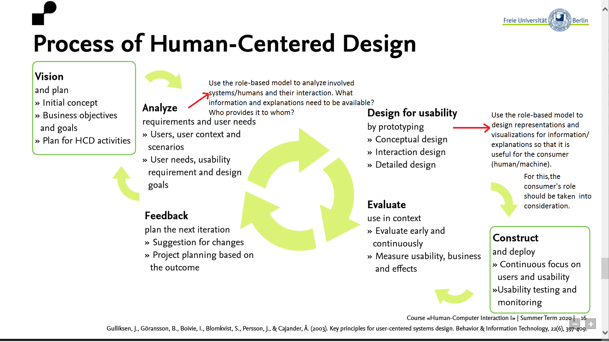
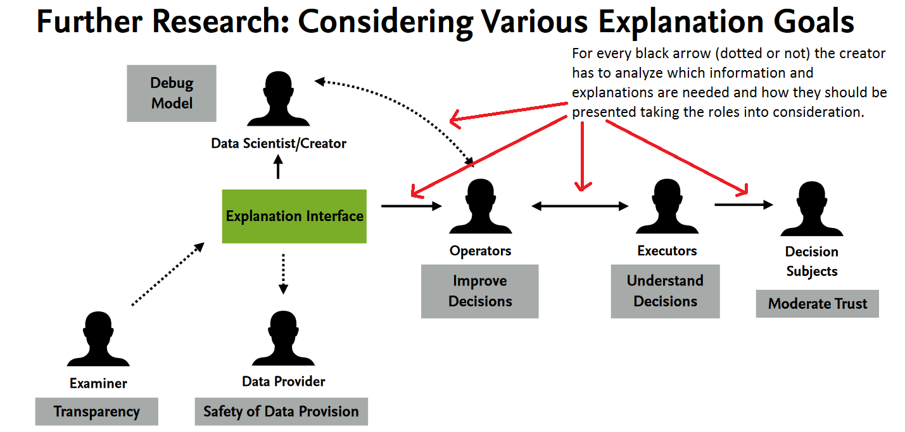

# Explanation
> **Date:** 23.12.2020 - 18:35 PM *(Due: 11.01.2020 - 03:00 PM)*
> **Name:** `chki` Christopher K.
> **Session:** [07 Exercise - Explanations](https://github.com/FUB-HCC/hcds-winter-2020/wiki/07_exercise)   
----

## A5 - Explanations

### Task 1: Different Explanation Needs

#### ORES Scenario
__Please describe the roles and the different explanation needs in the context of ORES by writing your own scenario.__
**Tool to fight vandalism in wikis**
Description: To detect vandalism in wikis, many machine learning algorithms have been developed and deployed.
These algorithms are often used by tools which then again assist editors and maintainers of wikis. For example, they can
highlight recent edits of articles that are likely to be damaging.
Usually, they also allow users to retrieve a quality assessments for articles or edits of interest.
ORES is an example for a web service/ API that provides machine learning models to score article and edit quality.
It is used by first party tools as well as third party tools.

* Creators
ORES is developed and maintained by Wikimedia. Some tools that use ORES are developed by Wikimedia itself but many tools are developed by third parties.

* Operators
ORES is used by developers (of mentioned tools) and editors. The latter often use tools instead of querying ORES directly.
This means that tools are also operating ORES and in this case the editor takes the role of the executor.
Additionally, there are also bots that query ORES but also take actions (-> operators and executors).

* Executor
The executors are mostly editors. They decide either based on information presented by tools or based on information they
retrieved themselves. As mentioned before, bots can also be executors (for example when they revert edits based on ORES' assessments).

* Decision-subject
Affected by the decisions are edits and articles as well as their creators (as their work can be reverted/altered).

* Data-subject
Depending on the model, the data used can differ. But in general the training and test data is based on the
articles/edits/reverts made in the past.

* Examiner
Examiners are most likely the developers (at Wikimedia and probably from third parties) and scientists.

__Explanation needs__
* Developers of tools and bots need to know how the model makes decisions to correctly include them into their tools. Tools need to provide insights and explanations the users.
* Editors may want to know how the models made their decisions because they execute actions accordingly.
  As Editors mostly use tools, these tools have to provide these explanations.
* Examiner need to understand the decision making and how inputs affect the results to judge the quality of models.
* Editors whose edits were reverted might want to know the reasons for this decision.

#### Reflection
Please consider yourself as a developer/data scientist using a human-centered design process to develop a new ML system:
When would you use this HCI method (role-based model) in your design process and for what reason?
(🔲 Illustration + 2-3 sentences)
_your TEXT here_
I think, that the role-based model can be effectively used in phase one and two of the Human-Centered Design process.
In the analyzing phase, it can help to identify the users and their (explanation) needs. Analyzing the users (machines or humans)
will clarify how data and explanations have to be presented (see first illustration).
It might be enough to consider the direct users of the machine learning system in most cases.
But, I think it is also useful to think about the links between other roles as well to fully understand what has to be provided (see second illustration).

_your IMAGE here_

### Task 2: Explanation method: LIME

_LINK to your annotated notebook here_

_1: ID and IMAGE of your LIME explanations_
_2: ID and IMAGE of your LIME explanations_
_3: ID and IMAGE of your LIME explanations_

#### Reflection
_your TEXT here_