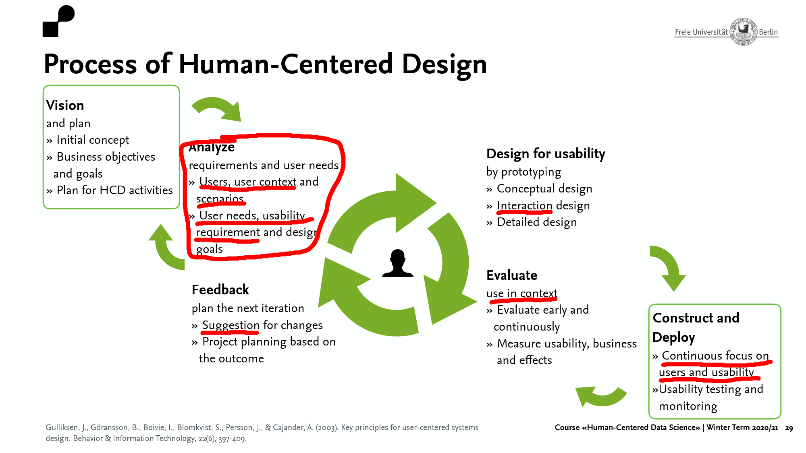
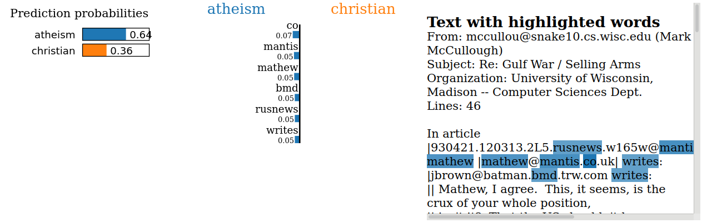
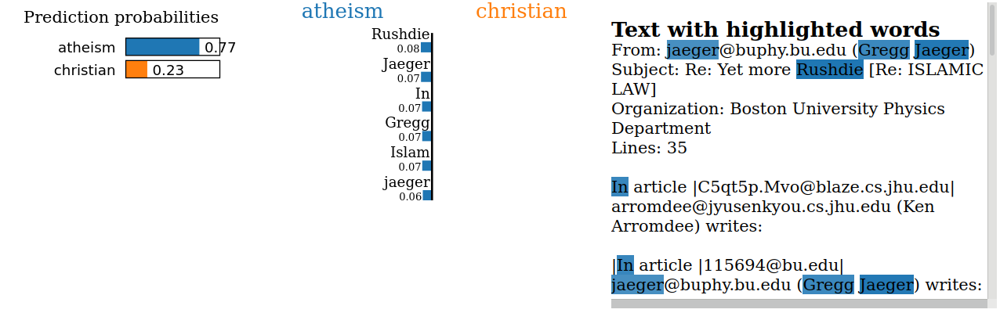
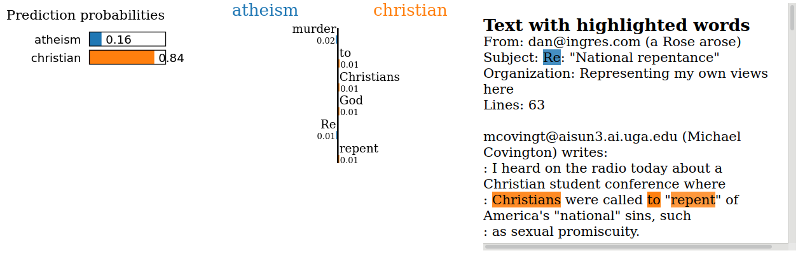

# Title of your post
> **Date:** 16.11.2020 - 18:35 PM *(Due: 11.01.2020 - 03:00 PM)*
> **Name:** `alsc` Alexa S.
> **Session:** [07 Exercise - Explanations](https://github.com/FUB-HCC/hcds-winter-2020/wiki/07_exercise)   
----

## A5 - Explanations

### Task 1: Different Explanation Needs

#### ORES Scenario

** Please describe the roles and the different explanation needs in the context of ORES by writing your own scenario. Tool to detect incomplete and unsufficiently proven articles

*Description:* ORES is a web service and API providing different machine learning tools for Wikimedia projects. It is used directly or by other tools and bots to provide other services in Wikimedia projects. Its main uses are the generation of article and edit quality scores.

* Creators: The Wikimedia Foundation developers and open source contributors.

* Operators: Any agent directly using the API, as well as tools and bots using it to provide their service.

* Executors: Any agent directly using the API, as well as tools and bots using it to provide their service and users being influenced by these tools or Wikimedias use of ORES while using Wikimedia projects.

* Decision-subject: The users of Wikimedia projects.

* Data-subject: The users of Wikimedia who have created or are creating new articles or edits.

* Examiners: The Wikimedia Foundation or any person inspecting the open source repository.

**Explanation needs**
* Users of Wikimedia projects may want to understand how a specific decision, like reverting an edit, was made, so the system has to give that information.
* Any outside Examiners inspecting the open source repository want to understand the inner workings of the system so all information and source code have to be displayed and well documented
* Providers of third party services and bots for Wikimedia projects need to understand how the tool works to properly develop tools and bots using it.

#### Reflection
The main use of this method would be in the Analyzing part of the planning. Here all users, their needs and requirements for using the product need to be defined, so the role-based model helps structure this part and the different user groups.

Though the usage would be most apparent in this part, we think that the role-based model could be used in all parts of the Human-Centered Design Process. While designing the product the user groups, their use scenarios and interactions need to be kept in mind. When evaluating the product and gathering feedback the role-based model can be useful to focus on the right groups of users and their suggestions.

Since the Human-Centered Design Process focuses on the Human/User at all times, it is apparent that defining the different Stakeholders and user groups through the role-based model can greatly help at all steps of the process.

### Task 2: Explanation method: LIME

_LINK to your annotated notebook here_

### 81

### 82

### 84

#### Reflection

1. Which documents did you choose?
  
    documents with the ids: 81, 82 and 84

2. What did you learn about the model?
  
    Even with the features listed it is quite hard to understand how the model classifies the data, since most features seem to be quite random, Such as names or the 'Re:' in the subject line being used to predict atheism. Some features make a lot of sense though, like 'God', 'Jesus' or 'murder'. When looking at the positions of the used words it becomes very apparent that the classifier uses the header and its structure for most of its atheism classification, which is why the words used don't really make a lot of sense in some cases.
3. How well do you think the classifier works? Why?
  
    Since the classifier a high F score of 0.924 as shown in the example notebook, the classifier seems to work very well. Since the classifier uses the header for most of its atheism classification, this may be very different when working with data with a different structure, though
4. For what role(s) (from task 1) are LIME explanations useful? Why?
    The created explanations can be useful for all roles. As stated in the 'Explenation Needs' section, pretty much all roles have an interest to understand the inner workings of the model for different reasons.
5. How useful is LIME for a non-data-scientist (e.g. non-ml-experts or designer)? Why?
    
    I would say it is quite useful, since it is very easy to use with a little guidance and can provide valuable insights for non-data-scientist as well.
6. What question types is LIME able to answer? Why?
  
    LIME is able to explain the inner workings of a model after it was used on data by answering how a classifier got to a specific chosen result and display the feature weights used.
