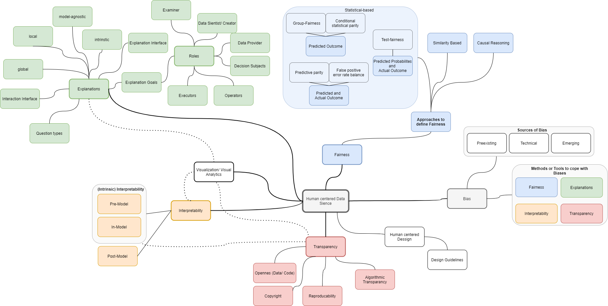

# 10 Exercise - Ethics
> **Name:** `albe` Ali B.
> **Session:** [10 Exercise - Ethics](https://github.com/FUB-HCC/hcds-winter-2020/wiki/10_exercise)   
----

## Preparation

Our Guest Speaker Jun.-Prof Dr. Susanne Michl is a Junior Professor for Medical Ethics and Medical Humanities at the Charité Berlin. She studied History and Romanistic Romance Philogy and wrote her Dr. Thesis about: German and french med. doctors durring the first world war.
Jun. Prof. Susanne Michl has expertise in fields like clinical ethics and ethics consulting, medical humanities, individualized/ personalized medicine. [Charité](https://medizingeschichte.charite.de/metas/person/person/address_detail/mendelsohn/)

- It is mentioned that data scientists and social scientist must work more collectively. How can this be archived? Are the terms we learned in this course e.g. Transparency, Explanation, different sources of Bias enough and proper as a common language for these two disciplines to communicate about data science and ethical topics on specific projects? 

- Does it maybe make sence to integrate people with expertise on ethics and humanities into the software development process like agile where these experts could be part of the stakeholders?

## Summary

The lecture was about artificial intelligence in medicine. Prof. Michl divided the lecture into three sections: In the first section she gave a general overview about theoretical works and discussions in ethics. She gave an overview of principles in ethics and what role ethics already played in medicine in the history. She explained out that since the 1960's there is an increased attention of companies paying attention to adopt the principles of ethics notable. She she pointed out that there is a huge gap between the  theoretical principles and the practical application of these.  Furthermore Prof. Michl showed with the help a diagram that our knowledge about the consequences of new technologies increase over while the flexibility to change established technologies decrease. As an example she gave the X-ray radiation. 

In the section section she introduced the actors in the field of medicine ethics and technology. The actors humans and machines and out definition of trust and interaction with these actors played an important role in this section. As an example she asked about a situation where a patient gets a diagnose from a doctor but asks to get the diagnose from the machine. 

In the third section Prof. Michls provided us one examples from the real world: Aspire Health, an AI service which predicts the remaining time a seriously sick patient will live. With these example she showcased the important role of ethics in the development  of AI systems.

## Mind Map

## Question

- Are there any sources or work available how the ethical principles can be practically applied in the real world in concrete software (AI) projects?

- Technology can help to take over repeating tasks and free time to human caretakers and doctors to take care and listen to their patient. Is this already notable in today hospitals?

## Takeways
From my point of view it seems that we have some good tools and methods to cope with ethical issues we have been introduced in this course. I think in the future there a many areas (not only in health care) where AI will shape our world and will have an big impact. 

A special takeaway for me was the correlation between our knowledge of consequences about a new technology and our flexibility to change an established technology over time. Therefore my impression is that we need to make use of the methods learned to cope ethical issues and make them more mature in order to find possible consequences of a new technology in an earlier phase.

