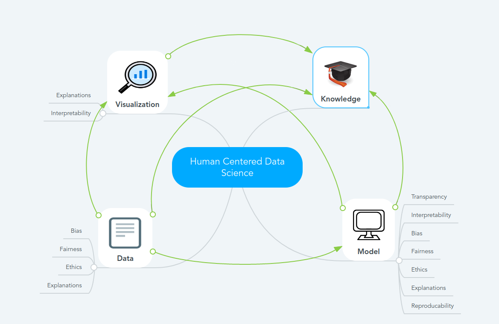

# Assignment 7
> **Name:** `frra` Franziska R.
> **Session:** [10 Exercise - Explanations](https://github.com/FUB-HCC/hcds-winter-2020/wiki/10_exercise)   
----

## Preparation

Jun.-Prof. Dr. Susanne Michl is a junior professor in Medical Humanities and Ethics in Medicine at the Charité Berlin. She works at the Institute for the History of Medicine and Ethics in Medicine which focuses on topics of modern medical history.

1. Ethics play an important role in the context of data science. How can you ensure that a model is ethically correct but still produces good results? Should one cut back on the accuracy of the results if this prevents social biases?
1. How can ethics in data science be made more relevant these days? We are taught a lot about this at the university, but people who have been working in this area for a long time may have less reference to ethics. 

## Summary
The guest lecture of Prof. Susanne Michl focused on artificial intelligence and the human-machine interaction from an ethical perspective. 
The lecture was splitted into 3 parts which covered historical classification of ethics, ethical relevant relationship context between human and machine and at the end which use of technologies in which context and to what extent are clinically and ethically useful, as well as the influence of data-based health care on different contexts. 

The area of ​​ethics has been developing steadily since the 1960s and today there are already many guidelines and principles that make it possible to facilitate and improve human-machine interaction.
An ethical approach to the development and deployment of algorithms, data and AI requires clarity and consensus on ethical concepts and resolution of tensions between values, that is why AI ethics must move beyond lists of principles. AI is only as good as the data behind it, and as such, this data must be fair and representativ. 

Computer-automated systems are used by humans, and humans are expected to remain essential contributors to artificial systems and automated systems in the future. Humans will continue to teach machines to perform tasks, explain the outcomes, and maintain the responsible use of machines. In order for machines to learn new tasks, humans must teach them. Humans also need to track and explain the outcomes for continued learning and better performance.

AI is playing an increasingly important role in healthcare as well. AI software platforms are currently being developed or implemented for use in many targeted healthcare applications, including medical diagnostics, patient monitoring, and learning healthcare systems.

If you use AI systems to make e.g. diagnoses, many are not sure how trustworthy this is. But in the end the human-machine interaction comes into play again. Data-based decision-making can be of great help in a clinical context.

## Mind Map

## Question
Ethics is neglected in various areas. How could you create more awareness for this topic? 

## Takeways
The guidelines that we have already dealt with are a good basis for the development of AI and software. Even if these are perhaps still in need of improvement and, as mentioned, one should move more from the principles to practice. We should also always be aware that human-machine interaction plays an important role and even if many activities can be automated, humans will still play an important role. I consider decision-making systems in healtcare to be sensible and helpful, and ethics should also be important in this area.
