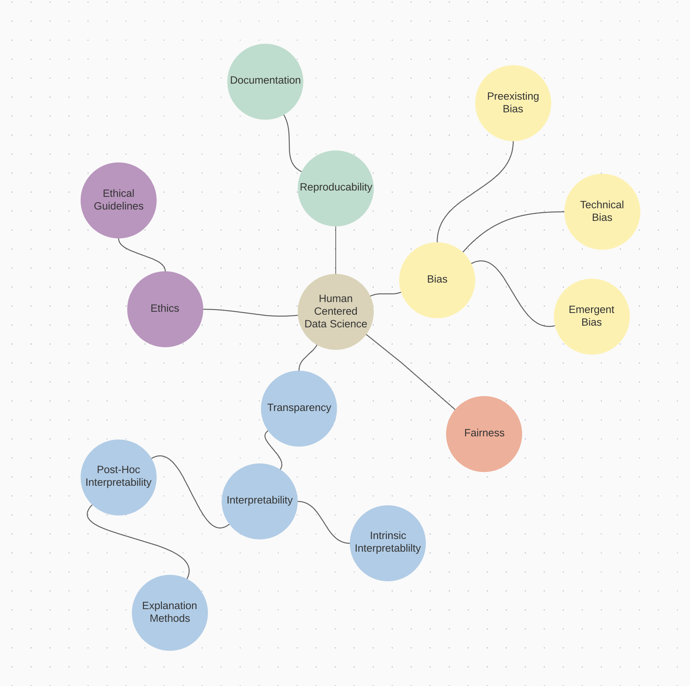

# 10 Exercise - Ethics
> **Name:** `luka` Lukas K.
> **Session:** [10 Exercise - Ethics](https://github.com/FUB-HCC/hcds-winter-2020/wiki/10_exercise)   
----

## Preparation

Our Guest Speaker Jun.-Prof Dr. Susanne Michl is a Junior Professor for Medical Ethics and Medical Humanities at the Charité Berlin. She studied History and Romanistic Romance Philogy and wrote her Dr. Thesis about: German and french med. doctors durring the first world war.
Jun. Prof. Susanne Michl has expertise in fields like clinical ethics and ethics consulting, medical humanities, individualized/ personalized medicine. [Charité](https://medizingeschichte.charite.de/metas/person/person/address_detail/mendelsohn/)

It is mentioned that data scientists and social scientist must work more collectively. How can this be archived? Are the terms we learned in this course e.g. Transparency, Explanation, different sources of Bias enough and proper as a common language for these two disciplines to communicate about data science and ethical topics on specific projects? 

Does it maybe make sence to integrate people with expertise on ethics and humanities into the software development process like agile where these experts could be part of the stakeholders?

## Summary

The talk reflects on the importance of ethics for the development of Artificial Intelligence systems, by taking a closer look at their occurrence in the medical field and the ethical problems caused. This leads to the conclusion that while AI is a good solution for making diagnoses, it lacks human intuition for certain decision situations. 

In the first part of the talk relevant aspects for ethical development are mentioned, such as implementing new behaviours instead of retrofitting ethical principles to a given behaviour (ethical shopping), refraining from using unsubstantiated ethical claims (ethical blue washing) and avoiding the usage of ethics against necessary legislations (ethical lobbying). It then raises the problem of ethical issues mostly occurring later in the developmental phase, when major changes can’t be easily implemented. Therefor more time has to be spent raising ethical problems as early as possible. Finally the focus shifts to ethical problems caused by the transition to automation in the medical field. It juxtaposes the old and new professional roles of medical practitioners by associating the prior with intuitive and empathetic procedures, while the latter is affiliated with technology-based procedures and finding correlations in data. This focus on data is described as being a key problem for certain decision situations, where higher success probabilities might suggest a false sense of safety for a procedure, or the fact, that value-based factors are being completely ignored by machines. 
This leads to the conclusion that while AI can be a good addition to the medical workflow, a fully autonomous artificial medical system is still a utopia. 

## Mind Map

## Question

* Would a completly automated medical systems be possible, especially considering the missing empathy and doctor-patient relationship ?

## Takeways

My main takeaway from the guest lecture were the risks of (unintensionally) acting unethical (ethics shopping, bluewashing, lobbying), since I hadn't really thought about the unethical problems that can arise by trying to be ethical. 
