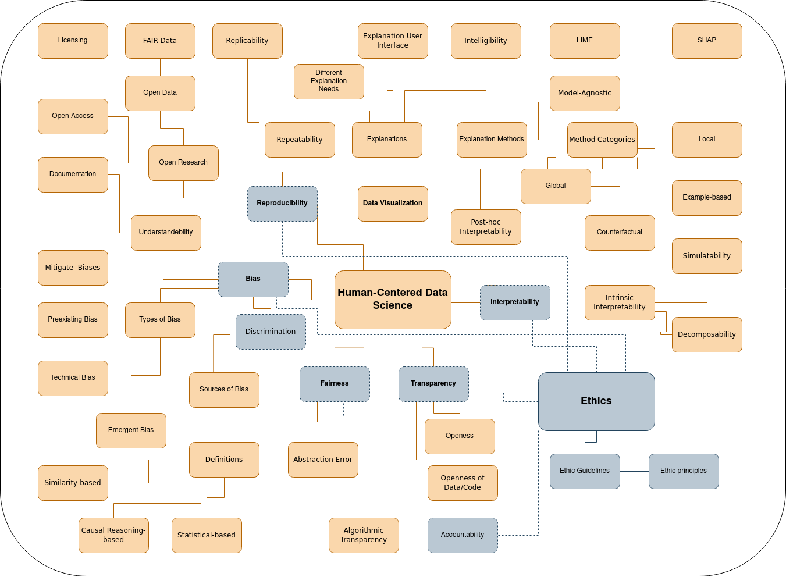

# 10 Exercise - Ethics
> **Name:** `mane` Marisa N.
> **Session:** [10 Exercise - Ethics](https://github.com/FUB-HCC/hcds-winter-2020/wiki/10_exercise)   
----

## Preparation

Jun.-Prof. Dr. Susanne Michl is a junior professor in the fiedld of Medical Humanities and Ethics in Medicine at the institute for the History of Medicine and Ethics in Medicine of the Charité Berlin. In her work she so far explored the mutual interdependencies of the humanities, medicine and data science.

1. It is mentioned that *"ethical deliberation is embedded in the everyday work of data scientists"*. What could a productive exchange in this everyday work with critics (i.e. ethical experts) look like? 
1. It is stated *"that  existing  ethical  frameworks  may  not  deliver  clear  answers  to  data  science challenges"*. What is needed here? What could a helpful frameworks look like? And how could it be established?

## Summary

The guest Lecture: "Artificial Intelligence and Human-Machine Interaction from an Ethical Perspective - A Utopian (and Dystopian) Look into the Future of Patient Care" was held by Jun.-Prof. Dr. Susanne Michl. The talk addressed the topic of ethics in the context of healthcare and patient care with a focus on the use of digital systems (e.g. ML systems, but also X-ray machines).

According to the structure of a play, Jun.-Prof. Dr. Susanne Michl organized her presentation in three parts: First a general overview and theoretical discussion of ethics (in a metaphorical sense as “introduction of the play”), second an description of the actors (i.e. humans, machines, etc. which are involved in the field of ethics) and last but not least the actual play (i.e. an insight of the current practical application of ethics within the field of healthcare).

More specifically, within the first section, Jun.-Prof. Dr. Susanne Michl gave a general definition of ethics, followed by a short historical account of the role that ethics has played and the problems that ethical experts had already been confronted with in the field of medicine in the past. In this context, she showed that today's ethical issues address problems that already existed in earlier times and for which solutions have already been discussed. In addition, she highlighted the increased attention paid to ethics since the 1960 and underlines this statement by showing a meta-study that identified over 84 currently existing guidelines on ethics, which were designed by a broad range of parties such as OpenAI and Google. She describes the gap between the described  principle-based guidelines and the practical use of such guidelines. She makes clear that often the problem does not lie in the lack of principles or incorrectly defined guidelines, but rather in conflicting principles. In the context, she calls for flexible and reflective approaches, which need to take procedural, deliberative, context-sensitive, and creative aspects into account.

In the next section, she make concrete examples about what is meant by conflicting principles by introducing different actors in the field of ethics. One example she presents is the tension between the principal of human autonomy and the use and need for automated machine systems. When the human autonomy is replaced by a machine, she states that a renewed definition of interaction between humans and machines with a specific focus on trust and responsibility is decisive to build ethical systems.

The last section comes with the concrete example of Aspire Health, an AI system that predicts the time of death of seriously ill patients. By means of this application, Prof. Dr. Susanne Michl shows that how ML systems can change the role of humans and machines and the new ethical issues which arise in this context.

## Mind Map

## Question

I would like to ask Jun.-Prof. Dr. Susanne Michl, if she thinks it might be possible to fully implement ethical principles into system or even build ML systems that can learn ethical guidelines, such that these systems become ethical experts by themselves?

## Takeways

For me, the idea of contradicting principles is really interesting and helpful. It can support to better understand the problems that can arise during data science practices in the context of ethics.
I also liked the idea that systems often are developed without considering ethics at first hand and that ethic often comes into play when its to late to completely change the system accordingly. This is important to remember when it comes to developing systems as a computer scientist.