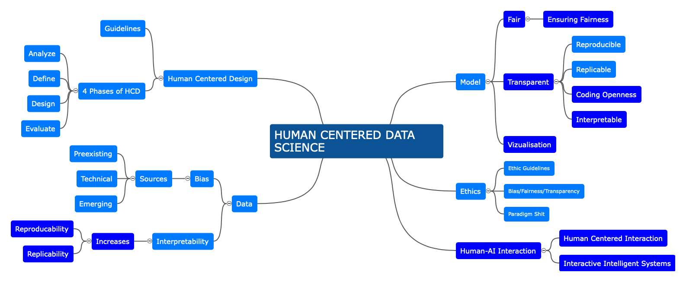

# Title of your post
> **Name:** `alsc` Alexa S.
> **Session:** [10 Exercise - Explanations](https://github.com/FUB-HCC/hcds-winter-2020/wiki/10_exercise)   
----

## Summary

In her guest lecture, she presents the ethical perspective of artificial intelligence and human-machine interaction. The speaker is Prof. Susanne Michl, Junior Professor since 2017 for Medical Humanities and Medical Ethics at Charité - Universitätsmedizin Berlin. Her research focuses on the ethical consequences both retrospectively and in the future in human medicine. The guest lecture was delivered in three parts: First, the lecture is placed historically in the context of ethics. The second part focuses on the ethical relationship context between humans and machines. In the last part, the impact on data-based healthcare on different contexts is highlighted. The notion of ethics shopping is introduced, which describes the selection of the most appropriate guideline regarding human-AI interaction. Then, important aspects in human-AI interaction are delineated: 
* Procedural aspects describe the continuous adjustment of principles instead of a rigid alignment according to abstract principles,
* Deliberative aspects denotes multidisciplinary perspectivation, i.e., the use of multiple cross-disciplinary perspectives,
* Context-sensitive aspects are data about complex social contexts,
* Creative aspects address the question of what future developments can be imagined,

Domain ethics combine possibilities of justification and principles with practical questions of orientation.
The dilemma here: the ability to shape the development of technology is high, the knowledge about the consequences of the development of technology is low.

She then moves on to the model of division of labor, which contrasts with the model of support. Machines are increasingly used when treatments are repetitive. Target variables for the use of artificial intelligence in reporting, for example, are
* Uniqueness, this is very rare in medicine,
* Uniformity, captures the deviation from the structured procedure
* Speed, as fast as possible, as slow as necessary
Finally mentioned key concepts is responsibility as an ethical principle, as well as trust as a social phenomenon

## Mind Map

## Question
When talking about Interactive Intelligent Systems, one realizes how difficult it is to teach an AI to act ethically. Are there any tools or approaches to ensure that an AI follows ethical guidelines?

## Takeways
...
