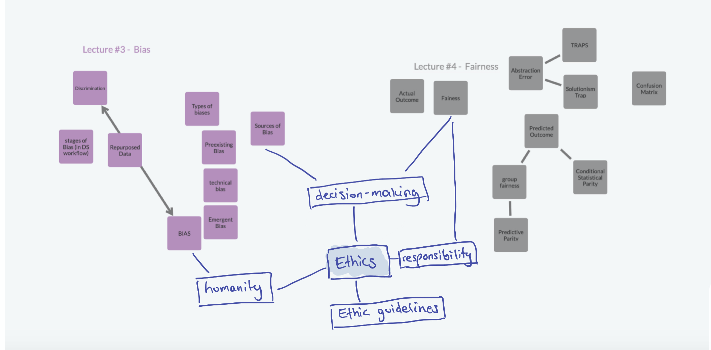

# Title of your post
> **Name:** `masc` Malina S.
> **Session:** [10 Exercise - Explanations](https://github.com/FUB-HCC/hcds-winter-2020/wiki/10_exercise)   
----

## Preparation

Susanne Michl is a Professor at Charité. Her area of expertise is Ethics, especially in the context of medicine. Therefore she does research on ethical implications in patient treatment such as personalization and individualization in human medicine. On top of being a Professor and researcher, she also works as a clinical ethics consultant.  

1. Should ethics become part of the core curriculum for data scientists?     

1. How can the clash between moral/ethics and business interest be solved?  

## Summary
The talk was about ethics in the context of human medicine with a focus on artificial intelligence. Professor Michl discussed possible future scenarios - negative as well as positive ones.  
She started her presentation with giving us a basic understanding and the definition of ethics and outlining how the field evolved over time. She also put emphasis on explaining how ethics is linked to technology and why it is gaining importance. In that regard, she gave different examples and incorporated her own experience as a researcher. She then proceeded to talk about automation and the role of ethics in designing autonomous systems, giving examplas from the medical field and human-machine interaction. One of her examples illustrated how artificial intelligence systems could support clinical decision making and almost act like real people being part of a discussion round. She further talked about trust and how it is linked to ethics and responsibility and how the trust in technological systems can be increased. One of the last topics she adressed in her presentation was how technology will bring changes to workplaces and how the roles might shift when tasks are redifined and partially being taken over by artifical intelligence systems.
To sum it up, the lecture was really informative and engaging, giving a good introduction on the role of ethics in the development of technology and ended with a very insightful and active discussion.

## Mind Map

## Question
Where did you acquire your ethics and medical knowledge? Was it difficult to transition from history and romanistics to medical ethics?  

## Takeways
I am very interested in medical technology and I did not know that ethics consultants exist in that field or that this is a profession in general. So I am happy to have learned something new and to know that ethics might play a more prominent role in the development of technology and data science in the future.  