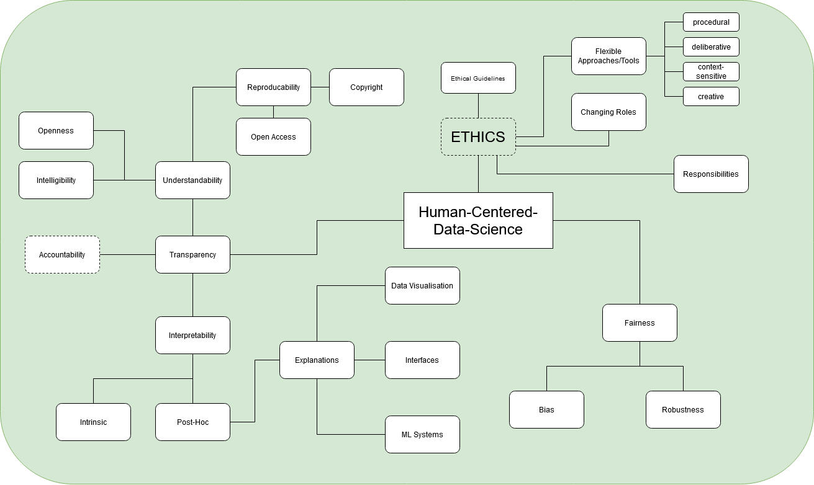

# Title of your post
> **Name:** `seku` Sebastian K.
> **Session:** [10 Exercise - Explanations](https://github.com/FUB-HCC/hcds-winter-2020/wiki/10_exercise)   
----

## Preparation

_some notes about the person gving the talk_

1. While some say, that bias inside of ML models is solely based on the complexity of the social world, isn't that also a factor, which influences the work of reaserchers while trying to create ethically correct models?
1. How does a single researcher or a group decide, weather a made decision in terms of the model is ethically correct or not?

## Summary

The lecture was held by Jun.-Prof. Dr. Susanne Michl and covered the topic of AI and Human-Machine-Interaction from an ethical experience. As a structural metaphor, she chose phases of a play, structuring her presentation into three parts. First, she spoke fundamentally about the definition of ethics and the means by which ethics are evaluated. In this regard, she showed in a historical discourse how strongly the topic has gained in importance since the 1960s. In addition, she showed by means of a meta-study that there are now over 84 guidelines on ethics, which are drafted by companies such as Google and Microsoft. \
Next, she explained that most guidelines are principle-based and that ethical problems usually arise from conflicting principles. As a solution approach, she explained that flexible/reflective approaches and tools are needed, which should consider procedural, deliberative, context-sensitive, and creative aspects of ethics. \
In the next section, she talked about the areas where ethics are becoming more and more important. There she described a cycle between human autonomy, autonomous machine systems, automated human actions and machine automation as a model of division of labor/support. Based on this, she described the importance of rethinking these interactions, as these interactions may have major ethical consequences.In this context, the development and use of digital technologies are in a field of tension between responsibility and trust. \
In the last section, Dr. Michl addressed the changes in knowledge production, agency, and role definitions that result from the development of new tools. It became clear that this raises a great many questions in the areas mentioned. In addition, role definitions are changing, since the tasks of, for example, medical professionals are also being altered as a result of the developments. She also cited the problems of AI in difficult therapeutic decision-making situations.

## Mind Map

## Question
Do you personally believe, that someday AI technologies can fully replace human interaction in difficult decision-making situations. In other words, will we at some point in time be able to blindly trust in the systems we develop?

## Takeways
I think the stated aspects, which should be kept in mind while developing practices and tools for ethical development are pretty useful, because they help to work with the versatility of ethics.
