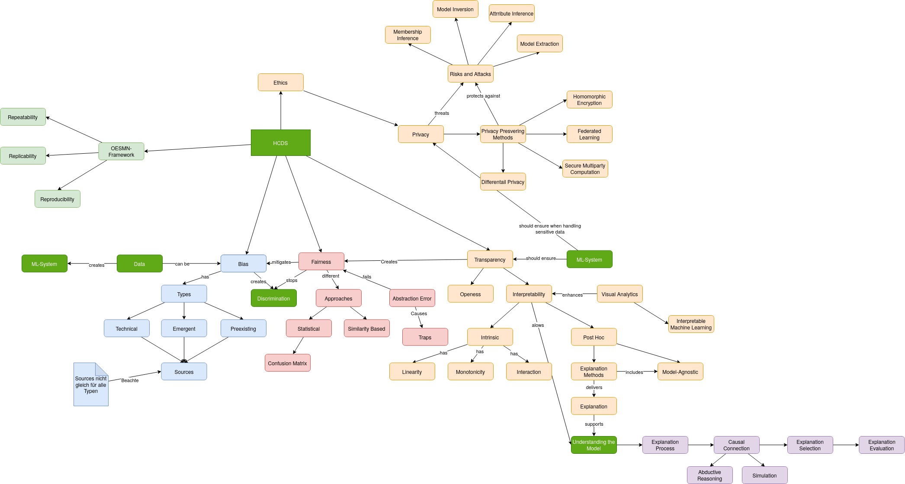

# Title of your post
> **Name:** `ansa` Anil S.
> **Session:** [10 Exercise - Explanations](https://github.com/FUB-HCC/hcds-winter-2020/wiki/10_exercise)   
----

## Preparation

_some notes about the person gving the talk_

The lecture will be presented by Franziska Boenisch. She is a computer scientist currently working at the research institute Fraunhofer AISEC. She specializes in the area privacy preserving machine Learning.

1. What are ways to protect the data?
1. If we can ensure privacy for less accuracy is the tradeoff worth it?

## Summary
The presentation of Franziska Boenisch is about privacy preserving machine learning, data protection and intellectual property protection for neural networks. As a introduction to the topic she presents a case study. Netflix made a machine learning competition and created a dataset about their users preferences. Some people could recreate the dataset (to some extent) from decoding their ratings on the IMDb site.

After the case study she seperated machine learning systems in two different classes. The first is the whitebox model and the second is viewed as a blackbox model. Then she presented different ways to recreate the model through decoding the training data.

The following methods were explained:
1. model inversion
1. attribute inversion
1. membership inference

Then she introduced us to privacy preserving Machine Learning techniques:
1. Homomorphic Encryption
1. Federated Learning
1. Secure Multiparty Computation
1. Differential Privacy

## Mind Map

## Question
1. If we can ensure privacy for less accuracy is the tradeoff worth it?

## Takeways
For my data science practice I will give more care when I am working with sensitive data. And I will give more attention to anonymization and pseudonymization. 
