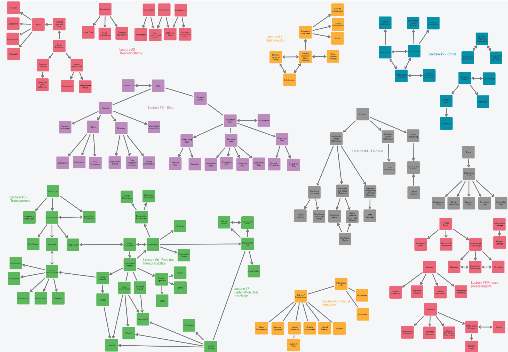

# Privacy and Machine Learning
> **Name:** `chki` Christopher K .
> **Session:** [11 Exercise - Privacy](https://github.com/FUB-HCC/hcds-winter-2020/wiki/11_exercise)   
----

## Preparation

Franziska Boenisch is a researcher at Frauenhofer AISEC. Her area of research deals with privacy issues related to machine learning applications. These applications might allow reconstruction of parts of the training data as well as checking whether an individual is represented in the training data. She is currently researching in the area of Differential Privacy, a mathematical framework that provides formal privacy guarantees.

1. How can a system be protected that continously learns from user input? 
1. When thinking about security for ML systems, do we also need to consider the impact on HCDS principles? For example, in the beginning of the paper it was mentioned that ensembling different learners is a way improve security of ML systems by making the predictions private. This sounds like it could not only affect the system's performace but also negatively impact aspects like (intrinsic) interpretability.

## Summary
The lecture dealt with the vulnerability of machine learning systems, resulting privacy issues and different ways to tackle them. Franziska Boenisch started by introducing basic terms like privacy, information leakage and privacy leakage. She also gave a general introduction on how a machine learning model works and how it is trained. Boenisch then discussed the threat space of machine learning models. It contains different scenarios with varying knowlege, capabilities and goals of the attacker. For example, the attacker might only have access to the model using an API but with unlimited API access. The lecture continued with an introduction to four possible attacks against machine learning systems: In model inversion attacks an adversary tries to use the model to restore training data or representations of training classes. In an attribute inference attack, the attacker's goal is to infer secret attributes using the model. In a membership inference attack, the attacker tries to find out whether a given data point was used to train a model. The fourth attack was the model extraction attack, where the attacker either tries to steal a model's functionality or to replicate it's behaviour. Boenisch then presented possible solutions for different use cases. For example, one can use Homomorphic Encryption which allows keeping the model private but running and training it in the cloud. Federated learning and secure multi-party computation are possible solutions for other use cases. Boenisch introduced differential privacy in more detail. The idea is to add noise to make the inference of private information harder. She concluded that privacy is an important issue of machine learning systems and that methods exist to preserve it. These methods usually cause overhead and lower the model's performance but the effectiveness depends on the correct use.

## Mind Map

I also include the link to Flinga since the image will be hard to decipher. I did not draw all too many connections between the lectures to keep the mind map as clean as possible.

[Mindmap Flinga](https://flinga.fi/s/F9NMZU7)   

## Question
* There was an example given in the lecture that showed the performance of a model that uses differential privacy with tuned hyperparameters. Even though it's performance was quite decent, many use cases require a better performance. Speaking from your experience, can you give some examples where a machine learning model using differential privacy performed really well?
* Do you have any experience on how introducing noise affects tools for model explanation? 
## Takeways

* Machine Learning systems are very vulnerable (and often use sensitive data)
  * A lot more sensitive information can be gained as expected
* There are a couple of ways to tackle security and privacy issues but in general at the expense of model performance
* These models might also interfere with other goals of HCDS (Transparency, ...)
* Differential Privacy uses the addition of noise to improve privacy of individuals that are represented in the learning data

