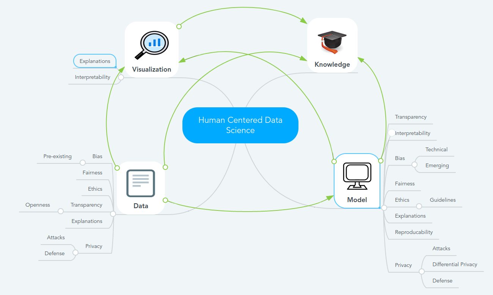

# Assignment 8 - Privacy and Security
> **Name:** `frra` Franziska R.
> **Session:** [11 Exercise - Privacy and Security](https://github.com/FUB-HCC/hcds-winter-2020/wiki/11_exercise)   
----

## Preparation

Franziska Boenisch is a research associate in applied and integrated security at Fraunhofer AISEC.  She is researching in the area of Differential Privacy at the moment. Her research interest lies at the intersection of Machine Learning (ML) and Data Privacy, as well as in the quantification of privacy loss and in the translation between a formal value of a privacy guarantees and real-world implications.

1. I was wondering if ML security and privacy policies can be somehow standardized? I know that this is dependant from the algorithm or data, but like the AI guidelines, there could be something general for the field of ML. 

2. Is there an human-centered model for usable security and privacy? Security and privacy mechanisms should not complicate workflows and should be transparent for the user

## Summary
The lecture focused on privacy and security of machine learning models. Starting with an introduction about machine learning models, she also explained the background of machine learning threat space, which includes several adversarial aspects.
Franziska Boehnisch also explained different privacy attack methods. 

1.Model inversion attacks are aimed at reconstructing training data from model parameters.
2. In an attribute inference attack, an attacker aims to infer a user's private attributes (e.g., location, gender, etc) via leveraging its public data.
3.  The membership inference attack aims to infer whether an input to the deep learning model is part of its training dataset or not.
4. Model extraction attacks are attacks in which an adversary obtains a new model, whose performance is equivalent to that of a target model.

To prevent such privacy attacks, she also introduced privacy preserving techniques.

1. Homomorphic encryption is a method of encryption that allows any data to remain encrypted while it’s being processed and manipulated. It enables one to apply functions on encrypted data without needing to reveal the values of the data. 
2. Federated learning is an approach that downloads the current model and computes an updated model at the device itself using local data. These locally trained models are then sent from the devices back to the central server where they are aggregated, i.e. averaging weights, and then a single global model is sent back to the devices.
3. Secure multiparty computation is a cryptographic protocol that distributes a computation across multiple parties where no individual party can see the other parties’ data.

Last but not least Franziska Boehnisch introduced the concept of differential privacy. Differential privacy is a strong, mathematical definition of privacy in the context of statistical and machine learning analysis. It provides a mathematically provable guarantee of privacy protection against a wide range of privacy attacks.

## Mind Map

## Question

Are whitebox models easier to attack due to their interpretability?

## Takeways
Some main takeaways were given at the end of the lecture:

1. Privacy leaks through "misconceptions"
2. Privacy methods exist, but they might cause overhead
3. Any tool's effectiveness depends on the correct use
4. Communication is important, as well as encouraging interdisciplinarity

Overall it was interesting to learn and hear about the different attack methods and prevention against privacy attacks. 
