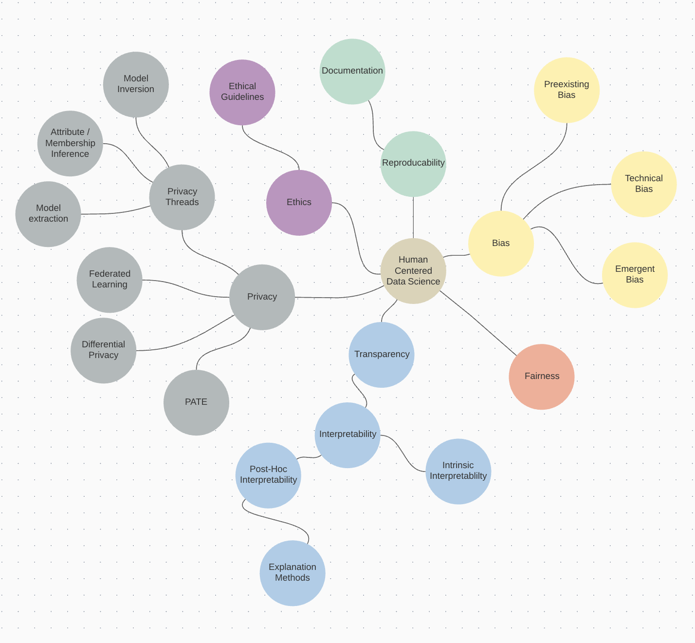

# A8 - Privacy and Security
> **Name:** `luka` Lukas K.
> **Session:** [10 Exercise - Explanations](https://github.com/FUB-HCC/hcds-winter-2020/wiki/10_exercise)   
----

## Summary

In her talk “Privacy Preserving Machine Learning: Threats and Solutions” Franziska Boenisch talks about privacy threads concerning machine learning and introduces multiple solutions to counteract them.

She starts with talking about Model Inversion, which allows models to be (partially) reversed therefor the training data can be recreated (with a certain loss). Another mentioned thread are Attribute and Membership Inference, which allow attackers to infer secret attributes by going through all possible solutions and picking the most likely one, or simply identifying whether a data point was used in the training process or not. Also since the training data of a given model might be available, a copy of that model can be established by running the same input through both models and training the copy on the output of the original. 

In the second half of the talk Boenisch introduces solutions to these problems. The first one being Federated Learning, which decentralises the model training across multiple autonomous devices. Another solution is the concept of Differential Privacy, meaning results of datasets should only change by a small margin depending on a single data point. This is used in PATE (“Private Aggregation of Teacher Ensembles”) where multiple Teacher models are trained on disjoined data, often with DP-SGD, which introduces noise to SGD to accomplish Differential Privacy. The aggregated results of those Teachers are then used to train the Student Model. Since only the Student model is published the exact training and therefor the used data can’t be inferred.

Finally Boenisch concludes that while these solutions add a great amount of privacy to Machine Learning Systems, they also cause a certain overhead and have subsequently only found use in smaller data cases. 

## Mind Map

## Question

* How does a method like PATE impact the overall Transparency of the model, since the Teacher models can't be made public ? 

## Takeways

For me the most profound idea introduced in the talk was the ability to recreate the input data given the model and the output. Since in most cases of Machine Learning I was mainly focused on the results a model produced with a certain input, I didn't really consider how this could be used the other way around to potentially reveal sensitive training information.
