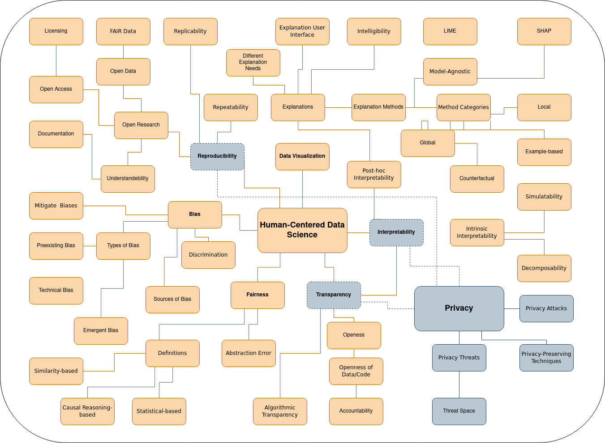

# 11 Exercise - Privacy
> **Name:** `mane` Marisa N.
> **Session:** [10 Exercise - Explanations](https://github.com/FUB-HCC/hcds-winter-2020/wiki/11_exercise)   
----

## Preparation

Franziska Boenisch is a computer scientist who has been working at Fraunhofer AISEC. The Fraunhofer AISEC is a research institute that is specialised in the area of application-oriented security. In her research and her ongoing PhD, Franziska Boenisch focussed on the protection of privacy, data and intelectual property in the field of ML.

1. Are there already any examples of security and privacy policies or a security framework in the context of ML? I am asking becasue I am siply courious if there are already some practical approaches.  
1. Is it realistic that there will be domain-agnostic formalisms for such policies? At the moment I can not think of an ML system charactaristic that would need specialized policies, but I wonder if there could be any.

## Summary

The guest Lecture: "Privacy Preserving Machine Learning: Threats and Solutions" was held by Franziska Boenisch. The talk addressed the topic of  privacy in the field of data analysis methods with a special focus on ML techniques.

The talk was structured in three phases: First a general overview on privacy and machine learning. Second, a more deeper look into some possible privacy risks and forms of attacks against ML systems, followed by the third section: an introduction of multiple techniques to perverse privacy. 

Franziska Boenisch starts the first section by giving a definition of  privacy and its threats and an rough introduction of the functionality of machine learning. A more detailed description of the thread space of machine learning systems in the context of privacy follows, where she introduces three different aspects: the adversarial knowledge, the adversarial capabilities and the adversarial goals.

In the next section, she explains different privacy attack methods by means of describing the goal of each attack and giving concrete examples. She introduces for example a method called model inversion, where the goal is to restore training data or representations of classes which are contained within the training set. Using the MINST data set as an example, she impressively demonstrates how a model can be used to reproduce the original digit classes. Additionally she gives an insight to the attack techniques attribute inference, membership inference and model extraction. 

The last section comes with multiple ways how to encounter such attacks. Franziska Boenisch notes that there is no such method that fits all but rather multiple methods that need to be configured  properly for each case. In the is regard, She explanations four different privacy-preserving techniques in detail: homomorphic encryption, federated learning, secure multiparty computation and differential privacy.

Concluding, Franziska Boenisch says that using privacy-preserving tools might be a trade-off between model performance, computational costs and other aspects on the one hand and the degree of privacy a system achieves on the other. She also notes that these methods needs to be configures correctly in order to work effectively.

## Mind Map

## Question

I would like to ask Franziska Boenisch, what she thinks about principles of HCDS that might be in contradiction with privacy-preserving methods such as the interoperability or transparency of ML systems. How can we differentiate between more or less important aspects in different scenarios?

## Takeways

For me, the concept of defining a threat space of a ML systems and to know the possible risks that come at hand is very helpful. This can help, for example, to avoid problems like Netflix had in the first place. I also like the different privacy-preserving methods. They make it possible to integrate privacy directly into the system.