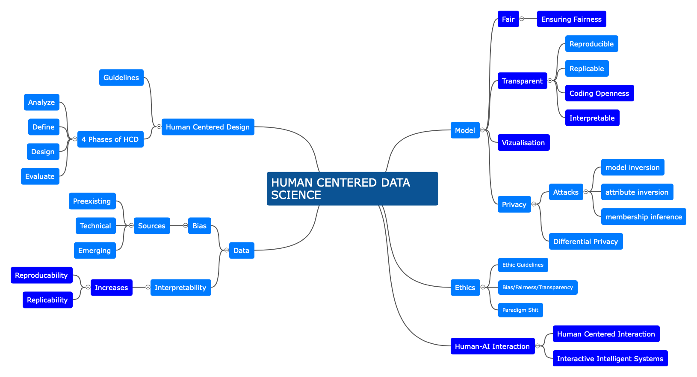

# A8 Privacy
> **Name:** `maop` Marc O.
> **Session:** [10 Exercise - Explanations](https://github.com/FUB-HCC/hcds-winter-2020/wiki/10_exercise)   
----

## Summary

The guest lecture is about Privacy Preserving Machine Learning, Data Protection and Intellectual Property Protection for Neural Networks. She points out that machine learning has gained interest in recent years. The topic is introduced by the following privacy concerning case: Netflix has been evaluating their user data in ordert to develop an ML algorithm to find relevant content for a user. In 2008, a linkage attack resulted in a privacy breach and the data of the user IDs could be deanonymized. A distinction is made between two types of machine learning systems: Whitebox (Trusted environment, closed to everyone, ml model is outside of box) and Blackbox (given a model, restore training data points). Her research has shown that there exist methods that can (partly) inverse the process of turning training data into a model. Those methods include “model inversion” (attacks in which representations of the training data are reverse-engineered from model parameters), “attribute inversion” (attacks that tempt to restore specific attributes from the training data), or “membership inference” (attacks that try to answer the question whether a particular data point was included in the model's training data or not). 
The goal is to design and implement a tool in which different types of such attacks against ML models are integrated in order to execute them on a model to evaluate its overall privacy level.

## Mind Map

## Question

## Takeways

