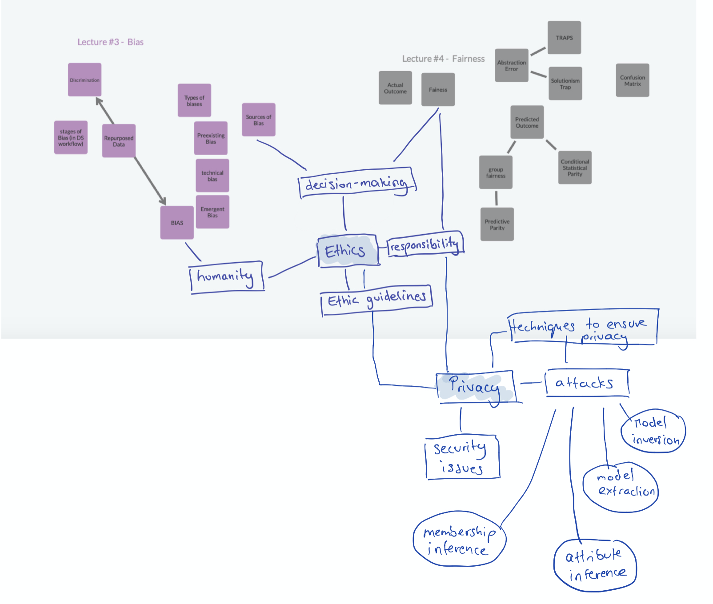

# Assignment 8 - Privacy and Security
> **Name:** `masc` Malina S.
> **Session:** [11 Exercise - Privacy and Security](https://github.com/FUB-HCC/hcds-winter-2020/wiki/11_exercise)   
----

## Preparation

Fanziska Boehnisch is a Computer Scientist and Researcher at the Secure Systems Engineering (SSE) Fraunhofer AISEC. She is currently pursuing a PhD at FU Berlin and her main areas of interest include Machine Learning and data privacy, mainly the quantification of privacy loss. 

1. If explaining a model is important for psychological acceptability but the most complex models and deep neural networks are black boxes and hence cannot be explained - how can psychological acceptability be achieved then?

2. Who should be responsible for ensuring security and privacy in ML through the proposed audit? The companies which develop the models or governments?

 ## Summary
Fanziska Boehnisch's lecture was about data privacy, security and the vulnerability of machine learning systems. An overview of different issues was given as well as an introduction to machine learning, privacy and information leakage.  

After introducing the main concepts of her lecture, Fanziska Boehnisch talked about potential threats in machine learning systems. She gave detailed examples about how these threats could look like and how they can interfere with privacy. Furthermore, she went into more detail to illustrate different privacy attack methods and the motivation behind them. One of the examples she gave in this context was the so-called model extraction attack. It is used to 'steal' the model by duplicating its functionality. Further examples were attribute inference, membership inference and inversion.
In the last part of her presentation, Fanziska Boehnisch gave solutions to battling these attacks. She noted that there is a variety of possibilities to ensure security and privacy in machine learning and that it needs to be decided individually which method fits best. However, she still introduced four techniques to preserve privacy: secure multipary computation, homomorphic encryption, federated learning and differential privacy. 

To conclude, Fanziska Boehnisch's lecture was a great introduction to the field of data privacy and security in machine learning. It gave a good overview about the basic terms, different types of attacks and possible solutions to tackle them. However, Fanziska Boehnisch also mentions that these data privacy techniques can also come with the tradeoff of reducing model accuracy.

## Mind Map

## Question
Does data privacy and security play a bigger role in Europe than it does in other countries since the general data privacy laws are stricter here?  

## Takeways
I found it a very interesting topic and one that I had very little prior knowledge about. I can imagine it being very important to consider in the development of ethical machine learning systems in the future.
