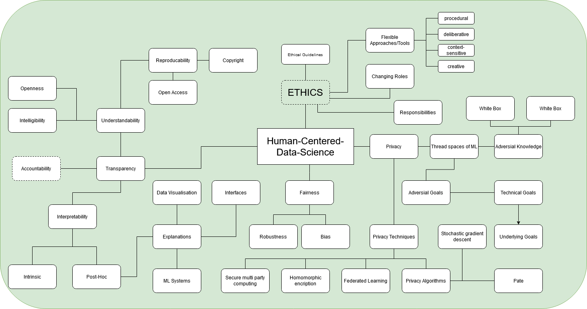

# 11 Exercise - Privacy
> **Name:** `seku` Sebastian K.
> **Session:** [11 Exercise - Privacy](https://github.com/FUB-HCC/hcds-winter-2020/wiki/11_exercise)   
----

## Preparation

Franziska Boenisch is a research associate at Frauenhofer AISEC, working on topics related to Privacy Preserving Machine Learning, Data Protection, and Intellectual Property Protection for Neural Networks, and PhD Student at FU Berlin. Her presentation will cover common privacy threat spaces in data analysis methods with a special focus on machine learning.

1. While researchers are trying to develop policies and guidlines for safer and better ML Systems, tech firms and/or corporations are developing systems that exploit a lack of legislation to the disadvantage of data creators. Due to the tremendous impact of those systems in terms of privacy violation, shouldn't there be stricter laws for ML System development or do you have a better solution?
1. Do you have an idea or some kind of concept for a security policy that would be sufficiently abstact to be understandable for humans as well as  sufficiently low  abstract to be understandable for machines?

## Summary
The lecture was held by Franziska Boenisch and covered the topic of privacy, especially in terms of machine learning. She started her presentation with an example in which Netflix organized a competition to develop a perfect recommendation algorithm. Participants got a dataset, where users and movies were anonymized. Nevertheless, developers managed to reconstruct the user- and movie names by working with the database of IMDb, which put an emphasis on the importance of secure privacy practices. 
After briefly explaining the concept of machine learning, she described potential areas of threat within it. In doing so, she made a distinction between technical and underlying goals. As a result, Boenisch mentioned different types of information that can be extracted from ML models, namely the training data (model inversion), secret attributes of the model (attribute inference), whether a given data point exists within the dataset (membership inference), or even the model itself (model extraction).
In the next section, she talked about several practices that can lead to safer models. In this regard, she mentioned homomorphic encryption, federated learning and secure multi-party computing. She also mentioned that there is no perfect practice, but it has to be chosen depending on the case.
In the last part of the lecture, she talked about two algorithms (stochastic gradient descent and pate), that were taken from different fields as an attempt to develop secure ML models. The benefit of those is, that they were already developed for another context, so already made insides could be used in the field of data science. She ended her presentation by emphasizing the importance of correct tool use to ensure effectiveness. She also explained that privacy leaks often are caused by misconceptions and that communication is tremendously important.

## Mind Map

## Question
Do you think that penetration testing should be a mandatory step in ML development to ensure secure systems and if so, should this be ensured by law?

## Takeways
I really liked the idea of combining concepts of different fields with data science and especially machine learning. Due to the rapid development of data science and ML it's highly nescesarry to keep the source of data and especially the humans behind it in mind. By applying concepts from other areas developers can use those insights to develop safer tools in terms of privacy. 
